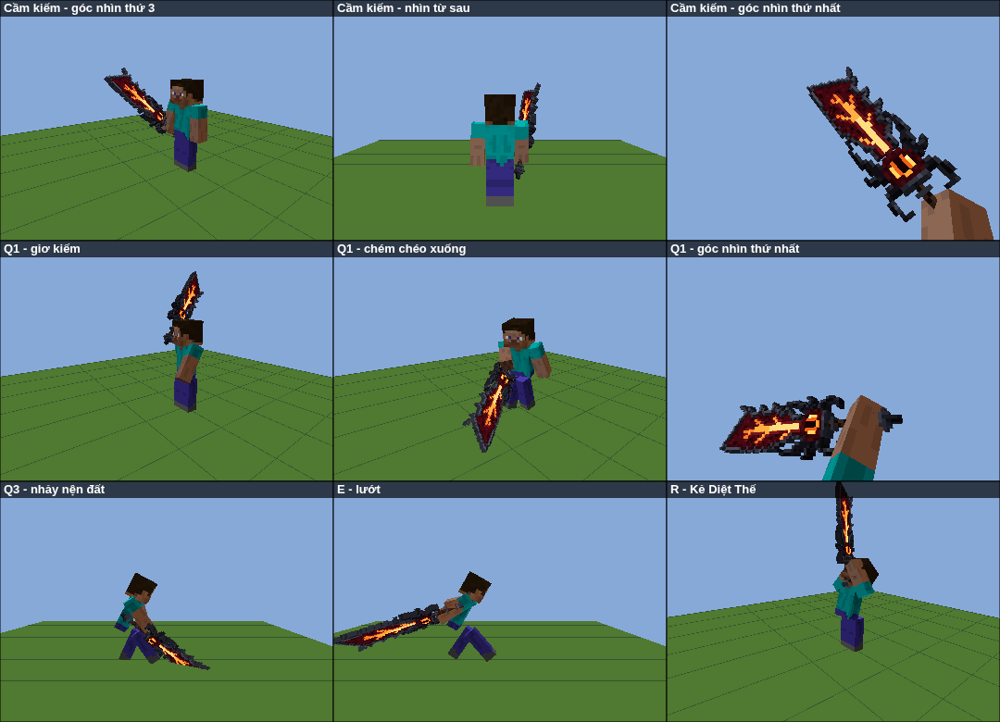
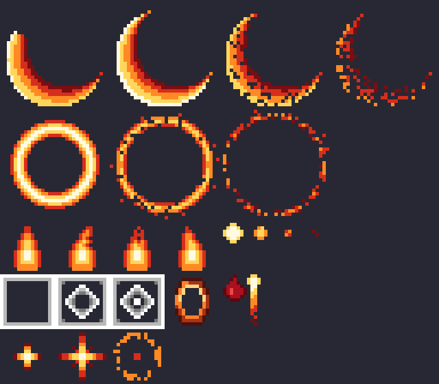

# Quỷ Kiếm Darkin — Addon Aatrox cho Minecraft Bedrock

Addon thêm thanh kiếm **Quỷ Kiếm Darkin** (`aatrox:darkin_blade`) với bộ chiêu mô phỏng Aatrox (LMHT),
viết bằng Script API `@minecraft/server` 2.0.0. **Không cần bật Beta APIs / thử nghiệm.**

Yêu cầu: Minecraft Bedrock **1.21.90 trở lên** (PC, điện thoại, console đều được).


Khi cầm trên tay, kiếm hiển thị bằng **model 3D** (164 khối) với **texture pixel art kiểu Minecraft**
(bảng màu giới hạn, sáng trên-trái, tối dưới-phải, nhiễu dither như texture gốc của game).

### Thiết kế bám theo bản gốc

Hình dáng được dựng theo thanh kiếm của Aatrox sau bản làm lại năm 2018, đối chiếu từ nhiều nguồn:
- **Splash art gốc** (Victor Maury vẽ): dòng dung nham sáng chảy dọc giữa lưỡi và phân nhánh, lõi sáng ở gốc lưỡi, cụm sừng đen cong vươn lên hai bên.
- **Splash Sea Hunter và Justicar** (được vẽ lại theo mẫu kiếm mới trong đợt làm lại): mắt Darkin nằm ở chắn kiếm với móng vuốt ôm quanh, lưỡi rộng dần về phía mũi, mũi vát chéo, sống lưỡi răng cưa lớn và một ngạnh móc gần mũi.
- **Icon chiêu Q và nội tại**: khung kim loại tối màu viền ngoài lưỡi, lõi thịt đỏ thẫm bên trong.
- **Wiki và các bài giới thiệu bản làm lại** (Nexus, Polygon, Rift Herald): Aatrox là "chiến binh cầm đại kiếm", thanh kiếm là nhà tù sống chứa linh hồn hắn.

Từ đó model gồm:
- lưỡi rộng dần, **mũi vát chéo**, sống lưỡi có **4 răng cưa lớn** và **ngạnh móc** gần mũi, lưỡi bén có khía nhỏ
- **khung kim loại tối** viền ngoài (dày hơn lõi), **lõi thịt đỏ thẫm** lõm vào giữa
- **dòng dung nham phân nhánh như cây** chảy từ mắt lên gần mũi, hắt ánh cam lên phần thịt xung quanh
- **mắt Darkin đồng tử dọc** trong hốc thịt ở chắn kiếm (có **mí mắt chớp** mỗi 4 giây), **cặp sừng đen** cong ôm hai bên gốc lưỡi, gai ngang và **móng vuốt** quặp phía dưới
- tay cầm dài quấn da (cầm hai tay) với 3 vòng kim loại, núm chuôi có gai

Dung nham và mắt là một lớp riêng vẽ bằng material `entity_emissive` với texture `.tga`
(kênh alpha thấp = phát sáng, giống texture blaze gốc) nên vẫn rực lên ban đêm.
Đây là model tự dựng theo phong cách Minecraft, mô phỏng thiết kế kiếm của Aatrox, không phải model hay texture gốc của Riot
(addon không chứa bất kỳ hình ảnh nào của Riot).

### Cầm kiếm và animation



- **Cầm kiếm:** tay nắm đúng chuôi kiếm, lưỡi chếch lên phía trước (giống cách cầm kiếm thường của Minecraft), dài xấp xỉ chiều cao nhân vật.
  Góc nhìn thứ nhất: kiếm nằm góc phải dưới, lưỡi chéo lên, thấy rõ mắt và dòng dung nham mà không che tâm ngắm.
- **Animation khi dùng chiêu** (cả người xung quanh lẫn chính bạn đều thấy):
  - **Q1** giơ kiếm qua vai rồi chém chéo xuống, **Q2** quét ngang từ phải sang trái, **Q3** nhảy lên hai tay giơ kiếm rồi nện xuống đất
  - **E** lao người về trước, kiếm kéo lê phía sau
  - **W** tay trái vung phóng xích (xích bay ra đúng lúc vung tay)
  - **R** khom người rồi gầm lên, dang tay giơ kiếm lên trời
- **Mắt Darkin trên kiếm chớp mắt** định kỳ.

## Cài đặt

- **Nhanh nhất:** tải file [`dist/AatroxDarkinBlade.mcaddon`](dist/AatroxDarkinBlade.mcaddon) rồi mở nó, Minecraft sẽ tự nhập cả 2 pack.
- **Thủ công:** chép `AatroxBP` vào `development_behavior_packs` và `AatroxRP` vào `development_resource_packs` trong thư mục `com.mojang`.

Sau đó tạo/sửa thế giới → **Behavior Packs** → bật *Aatrox - Quỷ Kiếm Darkin (BP)* (Resource Pack sẽ tự bật theo).

> **Đã cài bản cũ?** Bản này là **v1.3.0**. Trong thế giới, gỡ pack cũ ra rồi bật lại bản 1.3.0.
> Nếu vẫn thấy kiếm cầm như cây thương hoặc không có animation, vào **Cài đặt → Bộ nhớ** xoá hết pack Aatrox cũ rồi nhập lại file `.mcaddon`.

Lấy kiếm:
- Lệnh: `/give @s aatrox:darkin_blade`
- Chế tạo (bàn chế tạo, không cần xếp hình): **Kiếm Netherite + Ngôi sao Nether + Khối Redstone**
- Hoặc tìm trong túi đồ Sáng Tạo, mục Trang bị → Kiếm.

## Cách dùng chiêu

Bedrock không cho addon gán phím riêng, nên chiêu dùng các nút sẵn có: **chuột phải** (điện thoại: **chạm màn hình** hoặc nút Dùng/Đặt; tay cầm: **LT/L2**),
**khụy** (Shift / nút ngồi), **nhảy** và **chạy nhanh**:

| Thao tác | Chiêu | Hiệu ứng |
|---|---|---|
| **Chuột phải** | **Q — Quỷ Kiếm Darkin** | Bấm 3 lần liên tiếp (mỗi lần có 4 giây để bấm tiếp). Vùng chém hiện bằng ô rune dưới đất; **ô màu cam là điểm ngọt**: x1.6 sát thương, hất tung, choáng, giảm hồi chiêu nội tại. Lần 3 nện xuống vùng tròn |
| **Chạy nhanh + chém** (đánh trúng mob/block lúc đang chạy nhanh, hoặc chạy nhanh + chuột phải) | **E — Bước Nhảy Hắc Ám** | Lướt nhanh theo hướng nhìn |
| **Khụy + chuột phải** | **W — Xiềng Xích Địa Ngục** | Phóng xích lửa. Trúng thì gây sát thương, làm chậm, tạo vòng trói; sau 1.5 giây mục tiêu chưa chạy ra khỏi vòng thì bị kéo về, chịu thêm sát thương và bị choáng |
| **Khụy + nhảy** | **R — Kẻ Diệt Thế** | Sóng xung kích hất văng + làm chậm xung quanh, rồi biến hình 10 giây: +30% sát thương chiêu, +50% hồi máu, Tốc Độ II, Sức Mạnh I, nội tại hồi nhanh gấp đôi |
| **Đánh thường** (chuột trái / chạm vào mob) | **Nội tại — Tư Thế Tử Thần** | Khi sẵn sàng (8 giây): vết chém phát nổ thêm 8% máu tối đa của mục tiêu và hồi máu bằng lượng đó |

Mọi sát thương gây ra khi cầm kiếm đều **hút máu 15%**.

Bấm lúc tâm ngắm đang chỉ vào **khoảng không, mặt đất, tường hay mob** đều ra chiêu.
Riêng block/mob có thao tác riêng (rương, cửa, bàn chế tạo, giường, dân làng, ngựa, thuyền...) thì vẫn mở/dùng như thường.

**Để biết đang dùng được chiêu gì:**
- Lần đầu cầm kiếm sẽ hiện tiêu đề và hướng dẫn trong khung chat. Gõ `/scriptevent aatrox:help` để xem lại.
- Mô tả của kiếm (giữ chuột lên kiếm / chọn kiếm trong túi đồ) ghi sẵn cách dùng từng chiêu.
- **Thanh phía trên hotbar** hiện:
  `Nội tại ✔  Bấm: Q  Q ✔  E ✔  W 3.2s  R ✔`, trong đó **"Bấm: …"** là chiêu sẽ ra nếu bấm chuột phải ngay lúc này (đổi theo tư thế: `E (chạy nhanh)`, `W (khụy)  Nhảy: R`),
  phía sau là thời gian hồi chiêu. Bấm khi chiêu đang hồi sẽ nghe tiếng "cạch" và thanh hiện `W đang hồi chiêu: 3.2s`.

### Hiệu ứng particle



Addon có 11 particle riêng, texture pixel art tự vẽ. Phần lớn là **flipbook nhiều khung hình**:
hiệu ứng chạy hết các khung trong thời gian sống của particle.

| Particle | Hình | Dùng ở đâu |
|---|---|---|
| `aatrox:slash` | Lưỡi liềm lửa 4 khung: loé lên → rực nhất → rạn → vỡ thành tia lửa | Nhát chém Q |
| `aatrox:shock_ring` | Vòng lửa 3 khung: dày → mỏng → vỡ vụn | Sóng xung kích Q3, R |
| `aatrox:ground_mark` / `ground_mark_sweet` | Ô rune 3 khung hiện dần (khung → hình thoi → lõi), tô đỏ / cam | Báo trước vùng chém Q và điểm ngọt |
| `aatrox:ult_aura` | Ngọn lửa 4 khung bập bùng | Hào quang khi biến hình R |
| `aatrox:ember` | Tàn lửa 4 khung: cháy sáng → tàn thành đốm đỏ | Lửa bốc lên từ lưỡi kiếm, vệt lướt E |
| `aatrox:flash` | Chớp sáng hình sao 3 khung | Nổ điểm ngọt, nội tại, kéo xích |
| `aatrox:hit_spark` | Tia lửa dài bay theo hướng văng | Mỗi khi chiêu trúng |
| `aatrox:blood_burst` | Giọt máu pixel đặc, rơi xuống đất | Trúng điểm ngọt, nội tại, kéo xích |
| `aatrox:chain_link` | Mắt xích sắt nung đỏ | Sợi xích W và vòng trói |
| `aatrox:lifesteal` | Giọt máu phát sáng bay lên | Khi hút máu |

## Tuỳ chỉnh

Mọi thông số chiêu nằm trong [`AatroxBP/scripts/config.js`](AatroxBP/scripts/config.js): sát thương, hồi chiêu, tầm, bật/tắt đánh người chơi (`pvp`)...
Sát thương đánh thường của kiếm (9) nằm ở `minecraft:damage` trong [`AatroxBP/items/darkin_blade.json`](AatroxBP/items/darkin_blade.json).

Sửa xong thì chạy `python3 build.py` để tạo lại texture, model, animation, particle và file `.mcaddon`.
Nếu sửa rồi nhập lại vào game, nhớ tăng `version` trong 2 file `manifest.json` (nếu không Minecraft sẽ giữ bản cũ).

**Model 3D:** hình dáng kiếm là bản vẽ mặt trước dạng pixel trong [`sword_art.py`](sword_art.py)
(đường viền lưỡi, răng cưa, sừng, mắt, tay cầm; mỗi vật liệu có độ dày riêng trong `MATERIALS`).
[`model.py`](model.py) đùn bản vẽ thành khối 3D, gộp pixel cùng vật liệu thành khối lớn, vẽ texture pixel art (bảng màu trong `PALETTES`)
và xuất 2 geometry: `darkin_blade.geo.json` (phần thường + bone `eyelid` cho mí mắt) và `darkin_blade_glow.geo.json` (phần phát sáng, texture `darkin_blade_glow.tga`).
Có thể mở các file `.geo.json` bằng Blockbench để chỉnh tay.

**Tư thế cầm kiếm** nằm trong [`AatroxRP/animations/darkin_blade.animation.json`](AatroxRP/animations/darkin_blade.animation.json).
Model attachable được gắn sao cho điểm `(0, 24, 0)` của model nằm ở bàn tay (đã kiểm chứng bằng model đinh ba, khiên, ống nhòm gốc),
và tâm tay cầm của kiếm đặt đúng điểm này, nên `position` chỉ dịch nhẹ vào lòng bàn tay, `rotation` là hướng kiếm, `scale` là độ lớn
(góc nhìn thứ 3: 0.5, góc nhìn thứ nhất: 0.45).

**Animation chiêu** sinh từ [`player_anims.py`](player_anims.py) ra `AatroxRP/animations/aatrox_player.animation.json`, script phát bằng `playAnimation`:
- góc nhìn thứ 3: độ xoay/dịch cộng thêm cho các bone của người chơi, cộng với hướng lưỡi kiếm mong muốn (cổ tay được giải ngược cho đúng hướng)
- góc nhìn thứ nhất: vị trí nắm tay và hướng lưỡi kiếm trên màn hình, script tự tính ra chuyển động của tay
- keyframe chém của Q ở 0.45 giây khớp với `Q.windup` trong `config.js`; đổi `windup` thì dời keyframe theo

**Particle:** chỉnh trong [`particles.py`](particles.py) (hình sprite, bảng màu, số khung, tốc độ, thời gian sống), chạy lại `build.py`.

**Icon:** `art/item_icon.png` (túi đồ, 64×64) và `art/pack_icon.png` được render từ model 3D; thay 2 file này nếu muốn icon khác.

## Cấu trúc

```
bedrock/
├── AatroxBP/                  Behavior pack
│   ├── manifest.json
│   ├── items/darkin_blade.json
│   ├── recipes/darkin_blade.json
│   └── scripts/
│       ├── main.js            toàn bộ logic chiêu, nhận thao tác, hướng dẫn
│       └── config.js          thông số
├── AatroxRP/                  Resource pack
│   ├── attachables/           thay model cầm tay bằng model 3D
│   ├── animations/            tư thế cầm kiếm, chớp mắt, animation chiêu của người chơi
│   ├── render_controllers/    vẽ lớp phát sáng
│   ├── models/entity/         model 3D (.geo.json) + lớp phát sáng
│   ├── particles/             11 particle riêng
│   └── textures/              icon, texture model (.png + .tga phát sáng), texture particle
├── art/                       icon render từ model 3D
├── sword_art.py               bản vẽ pixel mặt trước của kiếm (hình dáng)
├── model.py                   đùn bản vẽ thành model 3D + vẽ texture pixel art
├── player_anims.py            thiết kế + giải ngược animation chiêu của người chơi
├── particles.py               định nghĩa particle + vẽ texture particle
├── build.py                   tạo texture, model, animation, particle + đóng gói .mcaddon
└── dist/AatroxDarkinBlade.mcaddon
```

## Lưu ý

- Choáng = hiệu ứng Chậm Chạp cấp tối đa; mục tiêu bị choáng vẫn nhảy được. Người chơi bị choáng thì không dùng được chiêu của kiếm.
- Mob vừa trúng đòn có khoảng bất tử ngắn (0.5 giây), nên dùng Q ngay sau một đòn đánh thường có thể bị giảm sát thương.

## Khắc phục sự cố

- **Bấm không ra chiêu, không có thanh hồi chiêu phía trên hotbar:** script chưa chạy. Kiểm tra đã bật **Behavior Pack** (không chỉ Resource Pack) và game từ **1.21.90** trở lên.
- **Có thanh hồi chiêu nhưng bấm không ra chiêu:** xem chữ **"Bấm: …"** trên thanh để biết chiêu sẽ ra; nếu chiêu đang hồi sẽ có thông báo thời gian. Đang bị choáng thì không dùng được chiêu.
- **Kiếm hiện dạng hình phẳng 2D, không có model 3D:** Resource Pack chưa bật hoặc đang dùng bản cũ, xem mục *Đã cài bản cũ?* ở trên.
- **Muốn đổi độ to / cách cầm kiếm:** sửa `scale`, `rotation` trong `AatroxRP/animations/darkin_blade.animation.json`.
