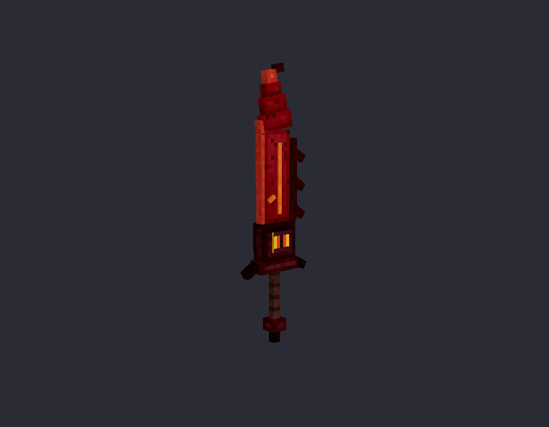

# Quỷ Kiếm Darkin — Addon Aatrox cho Minecraft Bedrock

Addon thêm thanh kiếm **Quỷ Kiếm Darkin** (`aatrox:darkin_blade`) với bộ chiêu mô phỏng Aatrox (LMHT),
viết bằng Script API `@minecraft/server` 2.0.0. **Không cần bật Beta APIs / thử nghiệm.**

Yêu cầu: Minecraft Bedrock **1.21.90 trở lên** (PC, điện thoại, console đều được).



Khi cầm trên tay, kiếm hiển thị bằng **model 3D** (21 khối) gồm lưỡi đỏ máu có gân dung nham, sống lưỡi đầy gai,
mũi kiếm cong, và **con mắt Darkin đồng tử dọc** ở gốc lưỡi. Trong túi đồ vẫn dùng icon 2D.
Đây là model tự dựng theo phong cách khối của Minecraft, mô phỏng thiết kế kiếm của Aatrox chứ không phải model gốc của Riot.

## Cài đặt

- **Nhanh nhất:** tải file [`dist/AatroxDarkinBlade.mcaddon`](dist/AatroxDarkinBlade.mcaddon) rồi mở nó, Minecraft sẽ tự nhập cả 2 pack.
- **Thủ công:** chép `AatroxBP` vào `development_behavior_packs` và `AatroxRP` vào `development_resource_packs` trong thư mục `com.mojang`.

Sau đó tạo/sửa thế giới → **Behavior Packs** → bật *Aatrox - Quỷ Kiếm Darkin (BP)* (Resource Pack sẽ tự bật theo).

Lấy kiếm:
- Lệnh: `/give @s aatrox:darkin_blade`
- Chế tạo (bàn chế tạo, không cần xếp hình): **Kiếm Netherite + Ngôi sao Nether + Khối Redstone**
- Hoặc tìm trong túi đồ Sáng Tạo, mục Trang bị → Kiếm.

## Điều khiển

Bedrock không cho addon gán phím riêng, nên chiêu được chọn theo **tư thế lúc bấm chuột phải** (điện thoại: nhấn giữ / nút Dùng):

| Thao tác khi cầm kiếm | Chiêu |
|---|---|
| Đánh thường | **Nội tại — Tư Thế Tử Thần**: khi sẵn sàng (8 giây), vết chém phát nổ thêm 8% máu tối đa của mục tiêu và hồi máu bằng lượng đó |
| Chuột phải | **Q — Quỷ Kiếm Darkin**: chém 3 lần (mỗi lần có 4 giây để chém tiếp). Vùng chém hiện bằng lửa dưới đất, **mép kiếm màu dung nham là điểm ngọt**: x1.6 sát thương, hất tung, choáng, giảm hồi chiêu nội tại. Lần 3 là cú nện vùng tròn |
| Ngồi + chuột phải | **E — Bước Nhảy Hắc Ám**: lướt theo hướng nhìn |
| Nhảy + chuột phải (đang ở trên không) | **W — Xiềng Xích Địa Ngục**: phóng xích lửa. Trúng thì gây sát thương, làm chậm và tạo vòng trói; sau 1.5 giây mục tiêu chưa chạy ra khỏi vòng thì bị kéo về, chịu thêm sát thương và bị choáng |
| Nhìn lên trời + chuột phải | **R — Kẻ Diệt Thế**: sóng xung kích hất văng + làm chậm kẻ địch xung quanh, rồi biến hình 10 giây: +30% sát thương chiêu, +50% hồi máu, Tốc Độ II, Sức Mạnh I, nội tại hồi nhanh gấp đôi |

Mọi sát thương gây ra khi cầm kiếm đều **hút máu 15%**.
Thanh phía trên hotbar (action bar) hiện hồi chiêu của nội tại, Q, E, W, R, số lần chém Q và thời gian biến hình còn lại.

## Tuỳ chỉnh

Mọi thông số nằm trong [`AatroxBP/scripts/config.js`](AatroxBP/scripts/config.js): sát thương, hồi chiêu, tầm, góc nhìn lên để dùng R (`lookUpPitch`), bật/tắt đánh người chơi (`pvp`)...
Sát thương đánh thường của kiếm (9) nằm ở `minecraft:damage` trong [`AatroxBP/items/darkin_blade.json`](AatroxBP/items/darkin_blade.json).

Sửa xong thì chạy `python3 build.py` để tạo lại texture, model và file `.mcaddon`.

**Model 3D:** hình dáng kiếm khai báo trong [`model.py`](model.py) (danh sách `CUBES`); `build.py` tự xếp UV, vẽ texture
và xuất `AatroxRP/models/entity/darkin_blade.geo.json`. Có thể mở file `.geo.json` bằng Blockbench để chỉnh tay.

**Vị trí kiếm trên tay** nằm trong [`AatroxRP/animations/darkin_blade.animation.json`](AatroxRP/animations/darkin_blade.animation.json)
(`position`, `rotation`, `scale` cho góc nhìn thứ nhất và thứ ba). Thông số khởi đầu lấy theo cây đinh ba (trident) của Minecraft;
nếu kiếm cầm lệch hoặc quá to thì chỉnh 3 giá trị này.

## Cấu trúc

```
bedrock/
├── AatroxBP/                  Behavior pack
│   ├── manifest.json
│   ├── items/darkin_blade.json
│   ├── recipes/darkin_blade.json
│   └── scripts/
│       ├── main.js            toàn bộ logic chiêu
│       └── config.js          thông số
├── AatroxRP/                  Resource pack
│   ├── attachables/           thay model cầm tay bằng model 3D
│   ├── animations/            vị trí kiếm khi cầm (ngôi thứ nhất / thứ ba)
│   ├── models/entity/         model 3D (.geo.json)
│   └── textures/              icon túi đồ + texture model
├── model.py                   định nghĩa model 3D + texture
├── build.py                   tạo texture, model + đóng gói .mcaddon
└── dist/AatroxDarkinBlade.mcaddon
```

## Lưu ý

- Choáng = hiệu ứng Chậm Chạp cấp tối đa; mục tiêu bị choáng vẫn nhảy được. Người chơi bị choáng thì không dùng được chiêu của kiếm.
- Mob vừa trúng đòn có khoảng bất tử ngắn (0.5 giây), nên dùng Q ngay sau một đòn đánh thường có thể bị giảm sát thương.
- Hiệu ứng hình ảnh dùng particle có sẵn của Minecraft, không cần tải thêm gì.
