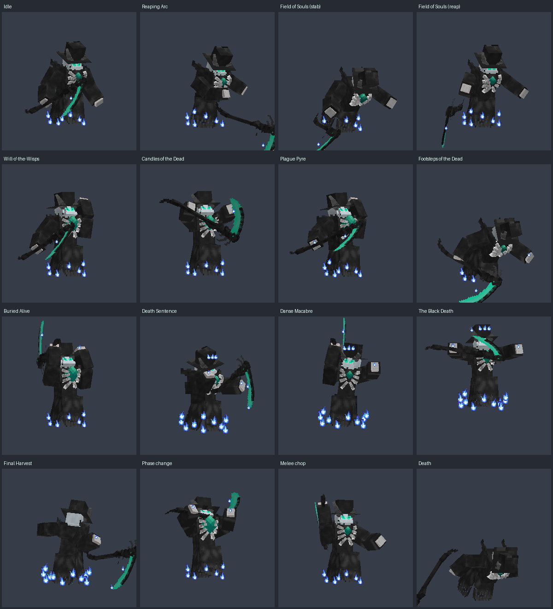
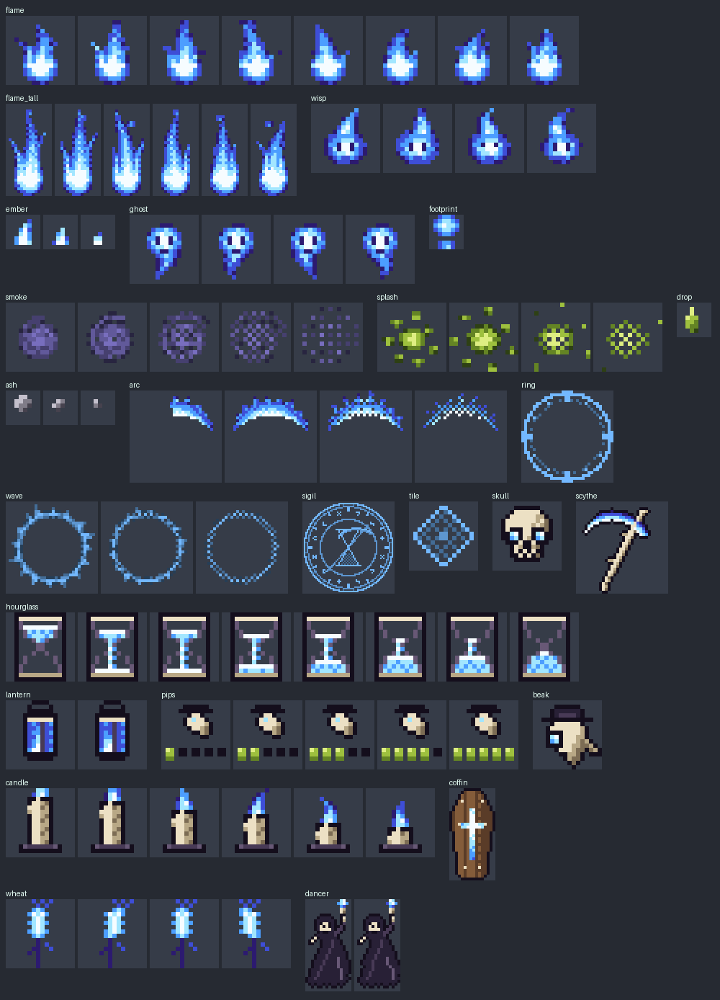

# The Harvester v1.5.0 — Thần Chết × Bác sĩ Dịch hạch

Boss **The Harvester** (`pa:harvester`): **Thần Chết** (lưỡi hái, mùa gặt linh hồn, đồng hồ cát, quan tài, vũ điệu tử thần)
kết hợp **Bác sĩ Dịch hạch** (mặt nạ mỏ chim, đèn lồng, dịch hạch, giàn thiêu).
Nguyên tố riêng của boss là **lửa hồn xanh**: lửa cháy **liên tục** trên người boss, và phần lớn chiêu để lại mặt đất cháy.
Bộ chiêu và bộ particle ở bản 1.5 là thiết kế riêng, **không lấy lại** chiêu hay kiểu vẽ của các addon khác trong repo
(Aatrox, Toji, Giant Zombie).

- Cài đặt: mở [`dist/TheHarvester_v1.5.0.mcaddon`](dist/TheHarvester_v1.5.0.mcaddon) (Minecraft tự nhập cả 2 pack).
  Nếu đã cài bản cũ: vào **Cài đặt → Bộ nhớ**, xoá các pack *The Harvester* cũ, nhập file 1.5.0,
  rồi trong thế giới bật lại cả Behavior Pack lẫn Resource Pack **1.5.0**.
- Kiểm tra nhanh: lửa xanh phải cháy quanh gấu áo và lưỡi hái của boss ngay khi nó xuất hiện.
  Không thấy lửa thì thế giới còn dùng pack cũ.
- Yêu cầu: Minecraft Bedrock **1.21.90+** (giống bản gốc), không cần bật Experiments.
- Gọi boss: `/summon pa:harvester`, hoặc gặp tự nhiên ở The End như trước.



## Lửa hồn xanh (luôn cháy)

Resource pack gắn các emitter lửa **chạy liên tục** vào người boss (không cần script, không tốn lệnh):

| Lúc | Chỗ cháy |
|---|---|
| Từ khi xuất hiện | vòng lửa quanh **gấu áo** + lửa trên **lưỡi hái** |
| Dưới 60% máu | thêm lửa ở **hai bàn tay** |
| Dưới 30% máu | gấu áo cháy **to gấp đôi**, thêm lửa ở **mũi lưỡi hái** và **vương miện lửa** trên đầu |
| Boss chết | lửa tắt |

Ngoài ra các chiêu Reaping Arc, Plague Pyre, Footsteps of the Dead, Buried Alive, Ember Retreat để lại **mặt đất cháy lửa hồn**
vài giây: đứng trong đó mất 1.5–3 máu mỗi nửa giây (sát thương lửa, nên **thuốc Kháng Lửa** chặn được).

## Bộ chiêu

Boss có **3 giai đoạn**. Mỗi chiêu đều có **dấu hiệu báo trước** (lúa hồn mọc, quan tài mở, nến thắp, dấu chân, vòng mặt đồng hồ...)
và boss **đứng yên** trong lúc vung chiêu nên có thể né.

**Chiêu nhắm vào mục tiêu của boss.** Mục tiêu là thứ vừa đánh boss hoặc vừa bị boss đánh, **người chơi hay mob đều được**
(iron golem, sói đã thuần, boss khác...). Không có ai như vậy thì boss nhắm người chơi gần nhất trong 32 ô.
Chiêu gây sát thương cho mục tiêu đó, cho các mob đang đánh boss (trong 30 giây gần nhất) và cho người chơi đứng trong vùng chiêu.

### Giai đoạn 1 — "Doctor of the Dead" (100% → 60% máu)

| Chiêu | Mô tả | Cách né |
|---|---|---|
| **Reaping Arc** (Nhát Gặt) | Kéo lưỡi hái ra sau rồi quét thấp hình quạt ~125°, bán kính 6.5 (7.5 ở GĐ3): 10 sát thương, hất lùi, +1 dịch hạch. Vết quét **bốc lửa hồn 3 giây**. | Ra khỏi vùng quạt dưới đất, đừng đứng lại trong lửa. |
| **Field of Souls** (Cánh Đồng Hồn) | Cắm lưỡi hái xuống đất: quanh mục tiêu mọc lên **các hàng lúa bằng lửa hồn** (ruộng ~13×13 ô, hàng chạy theo hướng boss → mục tiêu, cách nhau 3.2 ô, hàng của mục tiêu luôn có lúa). 1 giây sau boss **gặt cả cánh đồng**: mọi hàng lúa bùng lửa, 11 sát thương phép, hất nhẹ lên, +1 dịch hạch. | Bước sang **luống trống** giữa hai hàng lúa. |
| **Will-o'-the-Wisps** (Ma Trơi) | Giơ tay đèn lồng gọi 3 / 4 / 5 đốm **ma trơi** có mắt, trôi theo mục tiêu tới 7 giây, con sau nhanh hơn con trước (3.8 → 4.6 ô/giây). Chạm vào thì nổ: 6 sát thương phép, tối mắt 2 giây, +1 dịch hạch. | Đi bộ bỏ được con chậm, **chạy nước rút** bỏ được tất cả; đổi hướng để chúng đâm vào khoảng trống. |
| **Candles of the Dead** (Nến Âm Hồn) | Thắp 3 / 4 / 5 **cây nến hồn** thành vòng bán kính 5.5 quanh mục tiêu, cháy 7 giây (nến ngắn dần). Mỗi cây còn cháy **trả lại cho boss 10%** sát thương boss nhận. Hết giờ, mỗi cây còn cháy nổ thành cột lửa (9 sát thương phép trong 2.5 ô) và **hồi cho boss 2.5% máu**. | **Đứng lên một cây nến 1 giây** để dập tắt nó. Chia nhau dập hết. |

### Giai đoạn 2 — "Epidemic" (60% → 30%), thêm:

| Chiêu | Mô tả | Cách né |
|---|---|---|
| **Plague Pyre** (Giàn Thiêu Dịch Hạch) | Bác sĩ dịch hạch "thiêu" người nhiễm bệnh: đầu lâu và vòng giàn thiêu bám theo mục tiêu 1.5 giây, rồi **cột lửa hồn** bùng lên: 8 + 2 × số dịch hạch. **Lửa lan**: ai đứng trong 3.5 ô quanh mục tiêu cũng dính và bị +2 dịch hạch. Chỗ đó cháy tiếp 4 giây. | Người bị nhắm **chạy ra xa đồng đội**; uống sữa trước để giảm sát thương. |
| **Footsteps of the Dead** (Dấu Chân Người Chết) | Boss cúi xuống lần theo mặt đất: trong 3 giây mọi bước chân của người trong 22 ô để lại **dấu chân phát sáng**, rồi **tất cả dấu chân cùng bốc cháy** 3 giây (2 sát thương lửa mỗi nửa giây, +1 dịch hạch). Boss vẫn ra chiêu khác trong lúc đó. | **Đừng đứng yên, đừng quay lại đường cũ**: cứ đi về phía chưa có dấu chân. |
| **Buried Alive** (Chôn Sống) | Một **quan tài** 2 × 4 ô mở nắp dưới chân mục tiêu (đón đầu hướng chạy). 1 giây sau nắp đóng sập: ai ở trong bị **chôn** — đứng im 1.5 giây trong bóng tối, 6 sát thương phép, +2 dịch hạch, quan tài cháy lửa hồn thêm 3 × 3 sát thương. | Bước ra khỏi quan tài qua **cạnh dài** (chỉ cần 1–1.5 ô). |
| **Plague Aura** (nội tại) | Đứng sát boss (3.5 ô) bị nhiễm +1 dịch hạch mỗi 3 giây. Đòn đánh thường cũng lây dịch. | Đừng đứng dính boss quá lâu. |

### Giai đoạn 3 — "Final Harvest" (dưới 30%), thêm:

| Chiêu | Mô tả | Cách né |
|---|---|---|
| **Death Sentence** (Bản Án Tử) | Chĩa lưỡi hái vào tối đa 4 kẻ địch (mục tiêu luôn bị chọn trước): **đồng hồ cát** chạy 4 giây trên đầu, hết cát thì một **lưỡi hái ma** giáng xuống kèm cột lửa. Sát thương = 6 + 3 × số dịch hạch (dịch hạch bị tiêu hết). | Uống **sữa** để xoá dịch hạch trước khi hết cát. |
| **Danse Macabre** (Vũ Điệu Tử Thần) | Boss giơ lưỡi hái như cây đũa chỉ huy và nhảy điệu valse: **5 vũ công trùm mũ cầm nến hồn** xếp vòng 6 chỗ (bỏ trống 1 chỗ) bán kính 7 quanh mục tiêu, vừa xoay vừa **khép dần** vào tâm trong 3 giây. Chạm vũ công: 5 sát thương phép, chậm, +1 dịch hạch. Khi vòng khép lại: nổ 12 sát thương + héo ở tâm. | Lách ra qua **chỗ trống** của vòng (hoặc giữa hai vũ công) khi vòng còn rộng. |
| **The Black Death** (Cái Chết Đen) | Boss bay lên, khí đen và mưa dịch phủ vùng bán kính 16. Vài **đèn lồng linh hồn** hiện ra, mỗi cái có vòng sáng bán kính 2.5. Sau 3.6 giây: 14 sát thương phép + 2 dịch hạch cho ai đứng ngoài ánh đèn. | Chạy vào vòng sáng của một đèn lồng. |
| **Final Harvest** (Mùa Gặt Cuối) | Chiêu cuối: cả vành đất từ 3 đến 11.5 ô quanh boss **mọc kín lúa hồn** trong lúc lưỡi hái xoay trên đầu 2 giây, rồi boss **xoay người 360° gặt sạch**: 18 sát thương, héo, boss hồi máu theo số kẻ trúng. | Đứng **sát boss** (trong vòng xanh, không có lúa) hoặc ra **ngoài** ruộng lúa. |

### Cơ chế Dịch Hạch (Plague)

- Hầu hết chiêu cộng **stack dịch hạch**, hiện bằng biểu tượng mặt nạ mỏ chim và các ô vuông trên đầu nạn nhân (không dùng action bar).
- Đủ **5 stack** thì phát dịch (**Black Death pop**): 6 sát thương phép, héo 3s, buồn nôn 4s, rồi stack về 0.
- Không bị nhiễm thêm trong 6 giây thì cứ 3 giây mất 1 stack. **Uống sữa** xoá sạch. Boss chết cũng xoá hết.

### Độ trâu, giai đoạn, Enrage

- **1000 máu** (bản cũ 600). Kháng **Resistance I** (−20% sát thương) từ đầu, **Resistance II** (−40%) ở GĐ3 và khi enrage.
- **Miễn** sát thương rơi, lava, lửa, magma, chết đuối, ngạt, héo, đóng băng, xương rồng; **không bị đẩy lùi**;
  cung / nỏ / đinh ba chỉ gây 60% sát thương, nổ (TNT, crystal...) 50%. Bỏ "đứng trong lava mất 4 máu/tick" của bản gốc.
- Mỗi giai đoạn mạnh hơn: GĐ2 Speed I + Strength I, GĐ3 Speed II + Strength II + kháng lửa; sát thương chiêu ×1.15 / ×1.25 / ×1.4;
  hồi chiêu ×1 / ×0.85 / ×0.7; nghỉ giữa hai chiêu 2 / 1.5 / 1.1 giây.
- Chuyển giai đoạn: boss **gầm lên** (bất tử 2.2 giây), sóng xung kích đẩy lùi, cột lửa hồn và vòng lửa dưới chân, tên trên thanh máu đổi
  *Doctor of the Dead → Epidemic → Final Harvest*. **Không còn chữ / chat thông báo** trên màn hình.
- **Enrage** sau 5 phút chiến đấu: Strength III, hồi chiêu ×0.5, sát thương chiêu ×1.6, nghỉ giữa chiêu 0.7 giây.
  Đồng hồ enrage chỉ chạy khi đang đánh và **reset** nếu 30 giây không có ai.
- Không có ai trong 32 ô suốt 30 giây thì boss **tự hồi 1% máu mỗi giây**: bỏ chạy về hồi máu rồi quay lại không còn dễ.
- **Ember Retreat** (Lui Vào Tro): bị đánh có 7% boss **cháy thành tro** rồi hiện lại cách 5 ô, lùi ra xa kẻ đánh;
  chỗ cũ cháy tiếp 3 giây (tối đa 8 giây một lần, không dùng khi đang vung chiêu).
- **Soul Toll**: người chơi chết gần boss làm boss hồi 3% máu.
- Boss không rời xa quá 50 ô khỏi chỗ xuất hiện (bị kéo về + hồi 20 máu, như bản cũ).
- Chữ còn lại trên màn hình: cảnh báo của 3 chiêu cần né theo cách riêng (*SENTENCED*, *THE BLACK DEATH*, *FINAL HARVEST*,
  chỉ hiện cho người chơi ở gần) và dòng *THE HARVESTER FALLS* khi boss chết.

## Animation (18)

`idle` (lơ lửng, áo choàng bay, viên ngọc đập như tim), `move` (lướt, người đổ về trước), `attack` (bổ lưỡi hái từ trên xuống,
tự phát khi boss đánh thường), `spawn` (trồi lên từ tro), `death`, `phase_roar`, và 12 animation chiêu:
`skill_reap`, `skill_field` (cắm lưỡi hái xuống đất rồi gặt), `skill_wisps` (giơ cao tay đèn lồng rồi phóng), `skill_candles`
(ngửa hai tay rồi nâng lên), `skill_vanish` (Ember Retreat), `skill_pyre` (chỉ tay rồi nắm tay giơ lên), `skill_trail` (cúi lần theo
mặt đất rồi bật dậy), `skill_coffin` (chỉ vào mục tiêu, giơ hai tay, đập nắp quan tài), `skill_sentence`, `skill_danse` (giơ lưỡi hái
chỉ huy, lắc người theo điệu valse), `skill_blackdeath`, `skill_ultimate`.

- Thêm controller `soulfire` gắn lửa hồn liên tục theo máu của boss (bảng ở trên).
- Keyframe dùng nội suy Catmull-Rom (mượt như key "smooth" của Blockbench), mở được trong Blockbench để chỉnh.
- Model có **locator** (`blade`, `blade_tip`, `gem`, `eyes`, `hand_left`, `hand_right`, `feet`) để lửa và particle bám theo.
  Hình dáng model và texture **không đổi**.

## Particle (43) — kiểu vẽ riêng



Kiểu vẽ riêng của Harvester: **"tranh khắc gỗ memento mori + lửa hồn"**, không dùng lại kiểu dải nhiệt / vỡ vụn của các addon khác.
- **Lửa hồn xanh**: trắng → xanh băng → xanh hồn → chàm → viền tím than; ngọn lửa là những lưỡi lửa cong móc ở đầu.
- **Chuyển màu bằng dither** (lưới Bayer 4×4) thay vì cắt thành dải màu phẳng, và sprite tan biến cũng theo lưới đó
  nên vỡ thành ô cờ đều như bản in.
- **Đồ vật vẽ như tranh khắc gỗ** thời Vũ Điệu Tử Thần: viền mực, màu xương / giấy da, gạch chéo phía tối
  (đầu lâu, nến, quan tài, đồng hồ cát, đèn lồng, mặt nạ mỏ chim, vũ công, lưỡi hái ma).
- Khói vẽ thành **cuộn xoắn** thay vì cục tròn; vòng cảnh báo là **mặt đồng hồ** 12 vạch; vòng rune là **Ấn Mùa Gặt**
  (đồng hồ cát bắt chéo lưỡi hái).

Tất cả nằm trong `TheHarvesterRP/particles/harvester_*.json`, dùng chung atlas `textures/particle/harvester_particles.png`:
- Lửa hồn: `soulfire_hem`, `soulfire_hem_big`, `soulfire_blade`, `soulfire_hand`, `soulfire_crown` (5 emitter **lặp vô hạn** gắn trên boss),
  `soul_flames`, `fire_patch` (mặt đất cháy), `fire_column` (cột lửa), `soul_pillar`, `ember`, `gem_pulse`, `eye_glow`.
- Linh hồn: `soul_wisp`, `soul_burst`, `soul_stream` (hồn ma nhỏ có mắt).
- Nghi lễ của Harvester: `soul_wheat` + `wheat_burst` (lúa hồn), `will_o_wisp` (ma trơi), `candle` (nến cháy ngắn dần),
  `footprint` (dấu chân), `coffin` (quan tài), `dancer` (vũ công, bay vòng bằng Molang), `death_mark`.
- Lưỡi hái: `scythe_trail`, `scythe_trail_big` (vệt lửa hình trăng khuyết có lưỡi lửa), `spectral_scythe`.
- Dịch hạch & khói: `miasma`, `blackdeath_field`, `black_smoke`, `aura_mist`, `black_rain`, `plague_drip`, `plague_splash`, `ash_burst`.
- Cảnh báo & đánh dấu: `ground_warn`, `ring_warn`, `rune_circle`, `shockwave`, `skull_sigil`, `plague_pips`, `hourglass`, `beak_sigil`, `lantern`.

## Harvester Scythe (vũ khí rơi ra)

Giữ nguyên chỉ số, chỉ sửa lỗi và đổi hiệu ứng:
- **Sửa lỗi Soul Harvest không bao giờ hoạt động**: code cũ gây sát thương ngay trong `beforeEvents` (chế độ chỉ đọc) nên bị lỗi âm thầm.
- Shadow Reap / Soul Harvest / Soul Explosion / Death Mark dùng particle mới (vòng rune, vệt chém, linh hồn bay về người dùng, đầu lâu đánh dấu).
- Soul Explosion chỉ nổ khi có kẻ địch trong tầm (bản cũ nổ và báo chat mỗi 20 giây), và các chiêu diện rộng
  **không còn đánh dân làng, thương nhân, giáp đứng hay thú đã thuần**.
- Kill bằng chiêu của lưỡi hái giờ cũng tính cho Dark Blessing.
- Bỏ dòng hồi chiêu trên action bar (1.4). Dùng chiêu khi chưa hồi xong thì chat vẫn báo số giây còn lại.

## Bản 1.5.0 — chiêu và particle tự thiết kế, lửa hồn xanh cháy liên tục

- **Lửa hồn xanh cháy liên tục** trên người boss (gấu áo, lưỡi hái; thêm hai tay dưới 60% máu; lửa to hơn và vương miện lửa dưới 30%).
- **Bỏ các chiêu giống addon khác trong repo**: Phantom Scythes (giống ném 1/3/5 tảng đá của Giant Zombie), Chains of the Damned
  (giống W Xích của Aatrox, xích kéo của Toji), Death's Step và Shadow Blink (giống Heavenly Ambush của Toji: dịch ra sau lưng chém chữ X),
  Hands of the Underworld (giống tay / gai trồi từ đất của Giant Zombie), Soul Rend (giống nội tại % máu + hút máu của Aatrox),
  Graves of the Plagued (giống gọi lính của Giant Zombie), Shadow Reapers (vệt chém chữ X).
- **7 chiêu mới**: Field of Souls, Will-o'-the-Wisps, Candles of the Dead, Plague Pyre, Footsteps of the Dead, Buried Alive,
  Danse Macabre; nội tại Ember Retreat thay Shadow Blink. Reaping Arc để lại lửa, Final Harvest mọc lúa hồn trước khi gặt.
- **Vẽ lại toàn bộ particle theo kiểu riêng** (tranh khắc gỗ + lửa hồn dither), 43 particle; bỏ xích, vết nứt, chém chữ X,
  hố hư không, tay xương, bia mộ, đất vụn.
- 7 animation chiêu mới, controller lửa hồn. Ảnh xem trước vẽ cả lửa trên người boss.
- Giả lập kiểm tra từng chiêu mới: đứng luống trống thì không trúng, dập nến thì nến đó không nổ, bước ra khỏi quan tài thì không bị chôn,
  vừa đi vừa né thì không cháy dấu chân, lửa giàn thiêu lan sang người đứng cạnh nhưng không xa hơn...

## Bản 1.4.0 — boss trâu hơn, chiêu Thần Chết mới, bỏ chữ trên màn hình

- **Trâu hơn:** 1000 máu, Resistance I → II, miễn lửa/lava/rơi/ngạt..., không bị đẩy lùi, giảm sát thương từ đạn và nổ,
  tự hồi máu khi không bị đánh. Sát thương chiêu và tốc độ ra chiêu tăng theo giai đoạn.
- **Bỏ action bar:** không còn thanh thông tin boss (giai đoạn, % máu, dịch hạch, đồng hồ enrage) và dòng hồi chiêu của Harvester Scythe.
- **Bỏ thông báo chuyển giai đoạn:** không còn title / chat khi boss xuất hiện, chuyển giai đoạn, enrage hay phát dịch.
- **Chiêu nhắm đúng mục tiêu:** boss theo dõi thứ nó đang đánh (người hoặc mob), mọi chiêu nhắm vào đó và gây sát thương lên cả mob.
  Bản cũ chỉ tìm người chơi, mob đánh boss thì chiêu không trúng.
- **5 chiêu mới:** Phantom Scythes, Chains of the Damned, Hands of the Underworld, Soul Rend, Shadow Reapers.
  **Bỏ 4 chiêu:** Plague Flask, Murder of Crows, Pestilence Nova, Soul Harvest.
- **5 animation mới, 9 particle mới** (xem trên). Death's Step, Graves, Final Harvest và chuyển giai đoạn dùng thêm particle mới.

## Bản 1.3.3 — particle theo phong cách các addon khác

Vẽ lại 35 particle theo cách vẽ của Aatrox / Toji / Giant Zombie: vệt chém lưỡi liềm có mép trắng rồi vỡ thành tia,
khói phồng ra rồi tan thành pixel, sóng xung kích dày → mỏng → vỡ, lửa linh hồn 16×16 lắc lư, hồn ma, đầu lâu, lưỡi hái ma,
quạ ánh tím, bình thuốc thủy tinh, đồng hồ cát, đèn lồng linh hồn, bia mộ, mặt nạ bác sĩ dịch hạch. Chiêu và thời gian không đổi.

## Bản 1.3.2 — particle đơn giản kiểu Minecraft

Vẽ lại toàn bộ 35 particle cho giống particle vanilla: sprite nhỏ (8×8), ít màu, khối phẳng; khói co nhỏ dần qua 8 khung.
Kích thước hiển thị chỉnh lại cho vừa sprite mới. Chiêu, thời gian và hitbox không đổi.

## Bản 1.3.1 — sửa lỗi "không có skill, không có animation đánh" và dọn file rác

**Nguyên nhân không có skill:** `main.js` nạp tất cả script, và pack khai báo `@minecraft/server` **1.14.0**. Ở bản 1.14.0 chưa có
`world.beforeEvents.playerInteractWithEntity` / `playerInteractWithBlock`, nên `harvester_scythe.js` lỗi ngay khi nạp.
Lỗi đó làm cả `main.js` hỏng, toàn bộ script (kể cả boss) không chạy. Bản 1.2 gốc cũng bị y như vậy.
Ngoài ra `utimate_emeral_helmet.js` là code **KubeJS của Java Edition** (`PlayerEvents.tick`), không chạy được trên Bedrock.
- Nâng lên `@minecraft/server` **1.15.0** (bản đầu tiên có các event trên, cách gọi API giữ nguyên như 1.14).
- Mọi chỗ đăng ký event đều có kiểm tra, một event thiếu không làm hỏng cả script nữa.
- Boss không còn bỏ qua người chơi Creative (trước đây test trong Creative thì boss không bao giờ ra chiêu).
- Lọc chế độ chơi bằng `getGameMode()` thay vì chuỗi `"creative"` (tên enum này đổi thành `"Creative"` ở API 2.x).

**Animation đánh:** đòn chém thường giờ do resource pack tự chạy khi boss vung tay (`variable.attack_time`), không cần script.
Boss cũng vung lưỡi hái khi bắn đầu lâu wither (`ranged_attack` → `swing: true`).

**Sửa thêm:** 8 item (thỏi thép, thép thô, gậy thép, Super Smithing Update...) dùng custom component chưa hề được đăng ký;
bảng loot của boss rơi `pa:ender_dust`, item không có trong pack (đã bỏ, giờ rơi Reaper Skull hoặc End Stone + 8 Soul).

**Dọn file rác:** pack này được cắt ra từ addon "A chaotic world", còn sót lại đồ của Yeti, Giant Zombie, Robot Crab,
Ice Golem, vũ khí băng, Lamborghini... Đã xoá **~420 file**, pack giảm từ ~12.9 MB còn ~1.3 MB (file .mcaddon 0.2 MB):
- 10 script của mob/vũ khí không có trong pack (chạy mỗi tick vô ích), 2 file tiện ích chỉ chúng dùng, và `utimate_emeral_helmet.js` (KubeJS).
- ~165 function, 22 loot table, 11 spawn rule, trade, 4 recipe, 80 model, ~95 texture, 7 particle, âm thanh Yeti.
- Các file **ghi đè đồ vanilla**: `enderman.animation_controllers.json` (Enderman), `player.render_controllers.json`
  (cách vẽ người chơi), `materials/particles.material` (shader particle), và dòng lang đổi tên Mooshroom / Text-To-Speech.
- Khối lông Yeti `pa:fur_block` (6 texture 1024×1024 giống hệt nhau, ~7 MB, không có công thức, không ai rơi ra).
- File của app AddOns Maker (`.data`, `.error`), 4 animation controller giáp Dark Knight không gắn vào entity nào.
- Giữ lại: boss, Harvester Scythe, bộ Dark Knight, táo, thỏi/thép và mọi thứ chúng dùng. `A_chaotic_world_(beta)_`
  giờ chỉ give các item có thật trong pack. Tất cả file đã xoá vẫn còn trong lịch sử git nếu cần lấy lại.

## Các lỗi của bản 1.2 đã sửa (1.3.0)

- Nhầm **mili-giây với tick**: Chaos Storm kéo dài ~400 giây thay vì 8, Soul Vortex ~5 phút, Reaper's Judgment nổ sau 150 giây,
  Soul Harvest (chiêu cuối) chờ 22 giây. Bản mới tính mọi thời gian bằng tick, khớp với animation.
- Boss **tự sinh wither skeleton mãi mãi** mỗi 30–60 giây kể cả khi không ai ở gần (`minecraft:spawn_entity`), đã bỏ; lính giờ do chiêu Graves gọi và có giới hạn 8.
- Người chơi có thể **hồi máu cho boss bằng thỏi sắt** và boss "tặng hoa" (sót lại từ iron golem), đã bỏ.
- Hiệu ứng khi boss chết chạy trên entity đã bị xoá (lỗi âm thầm), và lệnh sinh `minecraft:chest` (không phải entity) đã bỏ.
- Thông báo chiêu gửi cho cả server; giờ chỉ gửi cho người chơi ở gần.
- Boss bỏ qua người chơi Spectator. Người chơi Creative vẫn bị boss nhắm chiêu (không mất máu), nên test trong Creative vẫn thấy chiêu.

## Cấu trúc & build

```
harvester/
├── TheHarvesterBP/ , TheHarvesterRP/   hai pack (đã sửa)
├── build.py            tạo lại particle + animation, kiểm tra tham chiếu/manifest/file rác, đóng gói dist/*.mcaddon
├── tools/
│   ├── art.py          vẽ sprite pixel art cho particle (kiểu khắc gỗ + lửa hồn dither)
│   ├── particles.py    atlas + 43 file particle JSON (kể cả 5 emitter lửa lặp vô hạn)
│   ├── animations.py   18 animation, controller, locator (có ghi chú hướng xoay của từng xương)
│   ├── render.py       renderer nhỏ để xem trước model/animation
│   ├── previews.py     ảnh trong previews/
│   ├── cleanup.py      liệt kê (hoặc xoá với --apply) file không dùng tới
│   └── simulate.mjs    chạy thử script trên mock @minecraft/server qua cả trận đấu
└── dist/TheHarvester_v1.5.0.mcaddon
```

- `python3 build.py` (cần `pip install pillow numpy`), thêm `--previews` để vẽ lại ảnh xem trước.
- `node tools/simulate.mjs`: nạp **toàn bộ** script qua `main.js` với đúng danh sách event/export của phiên bản
  `@minecraft/server` ghi trong manifest, rồi đánh giả lập ~17 phút (GĐ1 → GĐ2 → GĐ3 → enrage → boss chết, boss vào thẳng GĐ3,
  chỉ có người chơi Creative / Spectator, boss đánh nhau với iron golem mà không có người chơi). Báo: script không nạp được,
  lỗi không bắt, lỗi bị `try/catch` nuốt, particle thiếu biến Molang, animation không tồn tại, component item chưa đăng ký,
  lệnh ghi trong chế độ chỉ đọc, chiêu không trúng mob đang đánh boss, chữ trên action bar hoặc title ngoài danh sách cho phép.
  Thêm bài kiểm tra riêng cho từng chiêu mới (gọi qua `castForTest`, hàm chỉ dùng cho giả lập).
- Chỉnh sát thương, hồi chiêu, tầm: `CONFIG` ở đầu `TheHarvesterBP/scripts/harvester.js`.

## Lưu ý

- Mình chưa chạy được bản này trong Minecraft thật (chỉ chạy giả lập ở trên). Nếu thấy chiêu nào lệch hướng hay particle sai cỡ, báo mình để chỉnh.
- Pack được sửa trực tiếp. Nếu mở lại bằng app **AddOns Maker** rồi xuất lại, app có thể ghi đè các thay đổi này (file `.data` của app đã được xoá khỏi pack).
