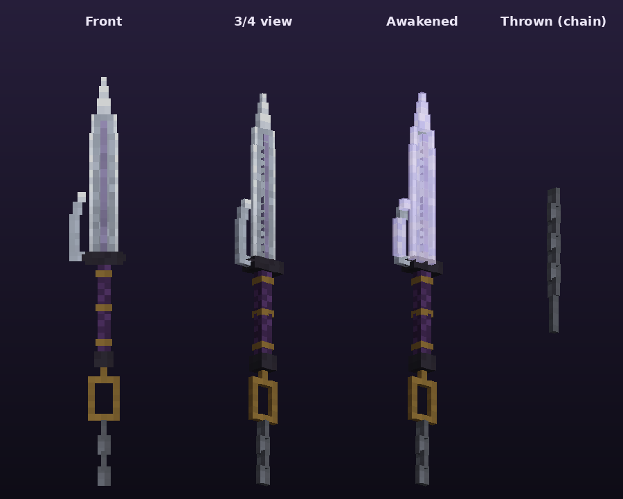
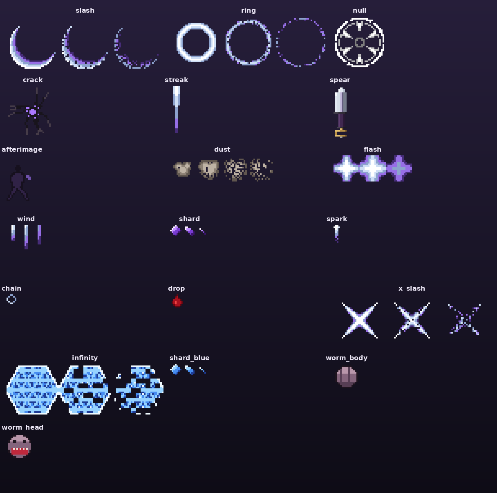

# Thiên Nghịch Mâu (Inverted Spear of Heaven) — Addon Toji cho Minecraft Bedrock

Addon thêm **Thiên Nghịch Mâu** (`toji:inverted_spear`) của Toji Fushiguro (Jujutsu Kaisen), bộ chiêu theo kiểu JJS.
Viết bằng Script API `@minecraft/server` 2.0.0, **không cần bật Beta APIs / experiments**.
Yêu cầu: Minecraft Bedrock **1.21.90 trở lên** (PC, điện thoại, console). Phiên bản hiện tại: **v1.3.0**.



## Cài đặt

1. Tải [`dist/TojiInvertedSpear.mcaddon`](dist/TojiInvertedSpear.mcaddon) và mở nó, Minecraft tự nhập cả 2 pack.
2. Tạo/sửa world → **Behavior Packs** → bật *Toji - Inverted Spear of Heaven (BP)* (Resource Pack tự bật theo).
3. Lấy mâu:
   - Lệnh: `/give @s toji:inverted_spear`
   - Chế tạo (bàn chế tạo, không cần xếp hình): **Trident + Echo Shard + Chain + Amethyst Shard**
   - Creative: Equipment → Swords.

> **Đã cài bản cũ?** Vào **Settings → Storage**, xoá hết pack Toji cũ rồi nhập lại file `.mcaddon`.
> Bản 1.0.0 có lỗi: mâu không nằm trong tay (thiếu gắn vào xương tay) và mâu quá to.

## Cách kích hoạt chiêu

| Thao tác | Chiêu | Tác dụng |
|---|---|---|
| **Chuột phải** (điện thoại: chạm màn hình / nút Dùng) | **Đâm Xuyên Vô Hạn** | Cảnh Toji đâm xuyên Vô Hạn của Gojo: lướt tới và đâm thẳng 6 ô. Trước mặt mỗi mục tiêu hiện **lớp kết giới lục giác xanh (Vô Hạn) rồi vỡ vụn**; mục tiêu bị xuyên, choáng ngắn và **mất sạch hiệu ứng có lợi**. Hồi 5s |
| **Khuỵu (Shift) + chuột phải** | **Xích Vạn Lý** | Mâu rời tay, **quay vòng quanh người theo sợi xích** (2 vòng, bán kính 4.5 ô), mỗi vòng quét trúng mọi kẻ địch xung quanh và hất văng ra; sau đó **ném mâu thẳng tới trước** (24 ô): trúng địch thì giật về + choáng, trúng tường/đất thì kéo mình tới (móc câu). Hồi 10s |
| **Chạy + chém** (chạy nhanh rồi đánh, hoặc chạy + chuột phải) | **Ám Sát Sau Lưng** | Toji không có chú lực nên không ai cảm nhận được: **biến mất trong làn khói, hiện ra sau lưng kẻ địch bạn đang nhìn** (tới 14 ô) và **chém chữ X** vào lưng nó. Không có mục tiêu thì lướt đi. Hồi 7s |
| **Cầm mâu 20 giây** | **Thiên Dữ Chú Phược: Thức Tỉnh** | Tự kích hoạt khi cầm liên tục đủ 20s: **chú linh kho chứa (con sâu) trồi lên và quấn quanh người** suốt 15s. Được Speed II, Strength II, Jump Boost II, Resistance I; sát thương chiêu x1.3, hồi chiêu giảm một nửa |
| **Cầm 20 giây + nhảy** (khi đang Thức Tỉnh) | **Thiên Dữ Loạn Trảm** | Mọi mob trong **vùng 20×20 block** quanh bạn bị ghim lại. Toji **chạy khắp khu vực, lao tới từng con, chém tổng cộng 40 nhát** (vòng quanh mục tiêu, cứ 5 nhát có 1 nhát **nhảy lên chém bổ xuống**), để lại bóng mờ trên đường chạy. Xong thì **chạy về đúng chỗ cũ**, trượt dừng, im một nhịp rồi **tất cả vết chém trên mọi con mob nổ cùng lúc** (mỗi nhát 2.5 sát thương, x1.3). Bất tử trong lúc chém. 1 lần mỗi lần Thức Tỉnh |
| **Đánh thường 4 lần liên tiếp** | **Combo M1 + Đòn Kết Liễu** | Đòn thứ 4 là cú xoay chém hình cung trước mặt, hất văng kẻ địch (như M1 trong JJS) |
| **Mọi đòn đánh** | **Nội tại: Vô Hiệu Hoá** | Đòn đánh thường cũng xoá hiệu ứng có lợi của mục tiêu |

- Thanh phía trên hotbar hiện tiến độ cầm `▮▮▮▮▯▯ 12/20s`, chiêu mà chuột phải sẽ dùng (`Bấm: Đâm / Xích / Trảm`), số combo và thời gian hồi chiêu.
- **Buông mâu (đổi sang ô khác) sẽ reset bộ đếm 20s và kết thúc Thức Tỉnh** (mất luôn buff). Hết Thức Tỉnh thì phải cầm lại 20s.
- Chữ trong game (chat, tiêu đề, thanh hồi chiêu, tên mâu) **tự theo ngôn ngữ game**: tiếng Việt nếu game để tiếng Việt, còn lại là tiếng Anh.
  Riêng dòng mô tả khi rê chuột vào mâu thì chọn bằng `loreLanguage` trong `config.js` (`"vi"` hoặc `"en"`).
- Gõ `/scriptevent toji:help` để xem lại hướng dẫn.
- Chuột phải vào rương, cửa, bàn chế tạo, dân làng, ngựa... vẫn dùng bình thường, không ra chiêu.

## Hiệu ứng: particle custom + animation



23 particle tự vẽ bằng pixel art (`TojiRP/particles`), phần lớn là flipbook nhiều khung:

| Particle | Dùng cho |
|---|---|
| `toji:thrust` | Vệt đâm bắn theo hướng nhìn (Đâm Xuyên Vô Hạn) |
| `toji:null_ring` / `toji:null_ground` | Vòng rune tím nứt vỡ, gai hướng vào tâm, trên mục tiêu / dưới đất khi bị vô hiệu |
| `toji:shard` | Mảnh kính tím vỡ tung (hiệu ứng của mục tiêu bị phá) |
| `toji:spear` + `toji:chain_link` | Mâu bay (mũi luôn hướng theo đường bay) và sợi xích nối về tay |
| `toji:slash` | Vết chém thép trắng-tím (Xích Vạn Lý, đòn kết liễu, Loạn Trảm) |
| `toji:afterimage` | Bóng mờ Toji để lại khi lướt |
| `toji:aura` / `toji:charge` | Gió trắng bốc lên khi Thức Tỉnh / gió tụ vào mâu trước khi Thức Tỉnh và khi đâm |
| `toji:shock_ring`, `toji:crack`, `toji:dust`, `toji:debris` | Sóng xung kích, nứt đất, bụi, đá văng |
| `toji:flash`, `toji:spark`, `toji:blood` | Chớp sáng, tia lửa thép, máu |
| `toji:infinity` + `toji:shard_blue` | Kết giới Vô Hạn lục giác xanh nứt rồi vỡ thành mảnh kính xanh |
| `toji:x_slash` | Vết chém chữ X khổng lồ (Ám Sát, Loạn Trảm) |
| `toji:worm_head` / `toji:worm_body` | Chú linh kho chứa quấn quanh người khi Thức Tỉnh |
| `toji:vanish` | Khói tối khi Toji biến mất |

**Animation người chơi** (`TojiRP/animations/toji_player.animation.json`, tạo bởi `player_anims.py`), bản thân thấy góc nhìn thứ nhất, người khác thấy góc nhìn thứ ba:

| Animation | Chuyển động |
|---|---|
| `thrust` | Lùi mâu về hông → lao người đâm thẳng → giữ → thu về |
| `whirl` | Giơ tay quay xích trên đầu 2 vòng, xoay người theo mâu → vung ném về trước |
| `ambush` | Hiện ra sau lưng → chém chéo phải xuống trái → chém chéo trái xuống phải (chữ X) |
| `finisher` | Xoay người lấy đà → quét mâu một vòng cung sang trái |
| `awaken` | Khuỵu gối tụ lực → đứng dậy vào thế cầm ngược mâu |
| `cut_a` / `cut_b` | Chém chạy: chân đang sải bước, người đổ về trước, chém chéo phải/trái xen kẽ |
| `leap_cut` | Nhảy lên co chân, giơ mâu qua đầu rồi bổ xuống |
| `rampage_end` | Về chỗ cũ: trượt dừng hạ thấp người, mâu chìa sang bên, rồi đứng dậy |

Ngoài ra còn rung màn hình, chớp màn hình khi Thức Tỉnh / Loạn Trảm, và âm thanh cho từng chiêu.

**Mô hình 3D**: lưỡi thẳng hai cạnh với sống tím, móc phụ bên cạnh lưỡi (kiểu jitte), chắn kiếm tối màu, chuôi quấn vải tím với đai đồng,
vòng đồng ở đuôi nối các mắt xích. Có 3 dạng: thường, **Thức Tỉnh** (thêm lớp phát sáng `entity_emissive` dọc cạnh lưỡi, sáng cả ban đêm)
và **Đã ném** (trên tay chỉ còn sợi xích). Script tự đổi dạng và giữ nguyên độ bền, phù phép, tên của mâu.

## Tuỳ chỉnh

- Mọi thông số (sát thương, hồi chiêu, tầm, thời gian cầm 20s, combo, PvP...) nằm trong [`TojiBP/scripts/config.js`](TojiBP/scripts/config.js).
- Tư thế cầm và kích thước mâu: `HOLD` trong [`packs.py`](packs.py). Chữ trong game: `LANG` trong `packs.py`.
- Sau khi sửa, chạy `python3 build.py` để tạo lại mọi file và `.mcaddon` (`python3 preview.py` để vẽ lại ảnh xem trước, cần Pillow).
- Nếu nhập lại vào game, tăng `VERSION` trong `packs.py` (Minecraft giữ bản cũ nếu trùng số phiên bản).

## Kiểm tra

Không cần mở game, [`test/sim.mjs`](test/sim.mjs) chạy chính `main.js` với một bản giả lập của `@minecraft/server`
và thử lần lượt: chuột phải, khuỵu + chuột phải (quay xích, ném trúng địch, móc vào tường), chạy + chém (hiện sau lưng / lướt khi không có mục tiêu), combo 4 đòn, cầm 20s, cầm 20s + nhảy,
đổi ô khi đang Thức Tỉnh / đang lao xuống, và bị choáng thì không ra chiêu được (61 bước kiểm tra):

```
node test/sim.mjs
```

Bản giả lập không có vật lý thật (hất văng, rơi chỉ được ghi lại), nên cảm giác trong game vẫn cần thử trực tiếp.

## Cấu trúc

```
toji/
├── TojiBP/             Behavior pack: items (3 dạng mâu), recipe, scripts/main.js + config.js
├── TojiRP/             Resource pack: attachables, animations, model .geo.json, 23 particle, textures, texts (vi_VN, en_US)
├── packs.py            manifest, items, recipe, attachables, tư thế cầm, file ngôn ngữ
├── model.py            dựng model 3D từ các khối + vẽ texture pixel art + icon
├── particles.py        vẽ atlas particle + file JSON particle
├── player_anims.py     thiết kế + giải ngược animation người chơi
├── build.py            chạy tất cả và đóng gói dist/TojiInvertedSpear.mcaddon
├── preview.py          vẽ preview.png / preview_particles.png
├── test/               giả lập @minecraft/server + kịch bản thử mọi chiêu
└── dist/TojiInvertedSpear.mcaddon
```

## Sửa lỗi

- **Bấm không ra chiêu, không có thanh hồi chiêu trên hotbar:** script chưa chạy. Kiểm tra đã bật **Behavior Pack** (không chỉ Resource Pack) và game từ **1.21.90** trở lên.
- **Mâu hiện thành hình phẳng 2D hoặc không nằm trong tay:** Resource Pack chưa bật hoặc còn bản cũ, xem mục *Đã cài bản 1.0.0?*.
- **Loạn Trảm không ra khi nhảy:** chỉ dùng được khi đang Thức Tỉnh (thanh hotbar hiện `THỨC TỈNH`), 1 lần mỗi lần Thức Tỉnh, và không dùng được ngay trong lúc đang ra chiêu khác.

Đây là mô hình/texture tự làm lấy cảm hứng từ Thiên Nghịch Mâu, không chứa hình ảnh gốc của Jujutsu Kaisen.
