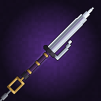

# Thiên Nghịch Mâu (Inverted Spear of Heaven) — Addon Toji cho Minecraft Bedrock

Addon thêm **Thiên Nghịch Mâu** (`toji:inverted_spear`) của Toji Fushiguro (Jujutsu Kaisen), bộ chiêu theo kiểu JJS.
Viết bằng Script API `@minecraft/server` 2.0.0, **không cần bật Beta APIs / experiments**.
Yêu cầu: Minecraft Bedrock **1.21.90 trở lên**.



## Cài đặt

- Mở file [`dist/TojiInvertedSpear.mcaddon`](dist/TojiInvertedSpear.mcaddon), Minecraft tự nhập cả 2 pack.
- Tạo/sửa world → **Behavior Packs** → bật *Toji - Inverted Spear of Heaven (BP)* (Resource Pack tự bật theo).
- Lấy mâu: `/give @s toji:inverted_spear`, hoặc chế tạo (bàn chế tạo, không cần xếp hình):
  **Trident + Echo Shard + Chain + Amethyst Shard**, hoặc trong Creative: Equipment → Swords.

## Cách kích hoạt chiêu

| Thao tác | Chiêu | Tác dụng |
|---|---|---|
| **Chuột phải** (điện thoại: chạm màn hình / nút Use) | **Nullifying Thrust — Đâm Vô Hiệu** | Lùi mâu về hông rồi lao tới đâm thẳng, xuyên mọi mục tiêu trên đường 5.5 ô, **xoá sạch hiệu ứng có lợi** của mục tiêu (Resistance, Regeneration, Absorption, Strength, Invisibility...). Hồi 5s |
| **Khuỵu (Shift) + chuột phải** | **Thousand-Mile Chain — Xích Vạn Lý** | Ném mâu theo xích về hướng nhìn (22 ô). Trúng mục tiêu: gây sát thương, choáng, vô hiệu và **giật mục tiêu về**. Trúng tường/đất: **tự kéo mình tới đó** (móc câu). Hồi 10s |
| **Chạy + chém** (đang chạy nhanh đánh trúng mob/khối, hoặc chạy + chuột phải) | **Heavenly Rush — Thiên Dữ Tốc Trảm** | Lướt xuyên qua kẻ địch, mỗi mục tiêu bị chém 3 nhát liên tiếp rồi bị hất ra. Hồi 6s |
| **Cầm mâu 20 giây** | **Heavenly Restriction — Thiên Dữ Chú Phược: Thức Tỉnh** | Tự kích hoạt khi cầm liên tục đủ 20s: 15s Speed II, Strength II, Jump Boost II, Resistance I, sát thương chiêu x1.3, hồi chiêu giảm một nửa. Mâu phát sáng tím, có aura gió quanh người |
| **Cầm 20 giây + nhảy** (khi đang Thức Tỉnh) | **Heaven-Splitting Plunge — Giáng Thiên Nhất Kích** | Nhảy vọt lên, giơ mâu lên trời, lật mũi xuống và cắm xuống đất: vùng 6 ô, 18 sát thương, hất tung, choáng, vô hiệu mọi thứ trong vùng. Không mất máu khi rơi. Dùng 1 lần mỗi lần Thức Tỉnh |
| **Mọi đòn đánh thường** | **Nội tại: Vô Hiệu Hoá** | Đòn chém thường cũng xoá hiệu ứng có lợi của mục tiêu |

- Thanh phía trên hotbar hiển thị: tiến độ cầm `▮▮▮▮▯▯ 12/20s`, chiêu mà chuột phải sẽ dùng (`Press: Thrust / Chain / Rush`) và thời gian hồi chiêu.
- **Buông mâu (đổi ô khác) sẽ reset bộ đếm 20s và kết thúc Thức Tỉnh.** Hết Thức Tỉnh thì phải cầm lại 20s.
- Gõ `/scriptevent toji:help` để xem lại hướng dẫn.

## Hiệu ứng (particle custom + animation)

17 particle tự vẽ bằng pixel art (thư mục `TojiRP/particles`), phần lớn là flipbook nhiều khung:

| Particle | Dùng cho |
|---|---|
| `toji:thrust` | Vệt đâm bắn theo hướng nhìn (Đâm Vô Hiệu, lúc lao xuống của Giáng Thiên) |
| `toji:null_ring` / `toji:null_ground` | Vòng rune tím bị nứt vỡ trên mục tiêu / dưới đất khi bị vô hiệu |
| `toji:shard` | Mảnh kính tím vỡ tung ra (hiệu ứng của mục tiêu bị phá) |
| `toji:spear` + `toji:chain_link` | Mâu bay (luôn hướng mũi theo đường bay) và sợi xích nối về tay |
| `toji:slash` | Vết chém thép trắng-tím (3 nhát của Tốc Trảm, vòng chém khi Giáng Thiên chạm đất) |
| `toji:afterimage` | Bóng mờ Toji để lại khi lướt |
| `toji:aura` / `toji:charge` | Gió trắng bốc lên quanh người khi Thức Tỉnh / gió tụ vào mâu |
| `toji:shock_ring`, `toji:crack`, `toji:dust`, `toji:debris` | Sóng xung kích, nứt đất, bụi, đá văng |
| `toji:flash`, `toji:spark`, `toji:blood` | Chớp sáng, tia lửa thép, máu |

**Animation người chơi** (`TojiRP/animations/toji_player.animation.json`, tạo bởi `player_anims.py`), có cả góc nhìn thứ nhất và thứ ba:
`thrust` (lùi mâu → lao đâm), `throw` (vung qua đầu → ném), `rush` (lao thấp → chém ngang → chém trái tay → bổ dọc),
`awaken` (khuỵu → đứng thế cầm ngược mâu), `plunge` (khuỵu → nhảy giơ mâu → lật mũi → cắm xuống).
Ngoài ra còn rung màn hình và chớp màn hình khi Thức Tỉnh / Giáng Thiên.

**Mô hình 3D**: lưỡi thẳng hai cạnh có sống tím, móc phụ bên cạnh lưỡi (kiểu jitte), chắn kiếm tối màu, chuôi quấn vải tím với đai đồng,
vòng đồng ở đuôi nối vài mắt xích. Bản Thức Tỉnh có thêm lớp phát sáng (`entity_emissive`) dọc cạnh lưỡi, sáng cả ban đêm.

## Tuỳ chỉnh

- Mọi thông số (sát thương, hồi chiêu, tầm, thời gian cầm 20s, PvP...) trong [`TojiBP/scripts/config.js`](TojiBP/scripts/config.js).
- Sau khi sửa model/particle/animation (`model.py`, `particles.py`, `player_anims.py`), chạy `python3 build.py` để tạo lại texture, model, particle, animation và file `.mcaddon`.
- Nếu nhập lại vào game, tăng `version` trong cả hai `manifest.json`.

## Cấu trúc

```
toji/
├── TojiBP/             Behavior pack: items (mâu + bản Thức Tỉnh), recipe, scripts/main.js + config.js
├── TojiRP/             Resource pack: attachables, animations, model .geo.json, 17 particles, textures
├── model.py            dựng model 3D từ các khối + vẽ texture pixel art + icon
├── particles.py        vẽ atlas particle + file JSON particle
├── player_anims.py     thiết kế + giải ngược animation người chơi
├── build.py            chạy tất cả và đóng gói dist/TojiInvertedSpear.mcaddon
└── dist/TojiInvertedSpear.mcaddon
```

Đây là mô hình/texture tự làm lấy cảm hứng từ Thiên Nghịch Mâu, không chứa hình ảnh gốc của Jujutsu Kaisen.
