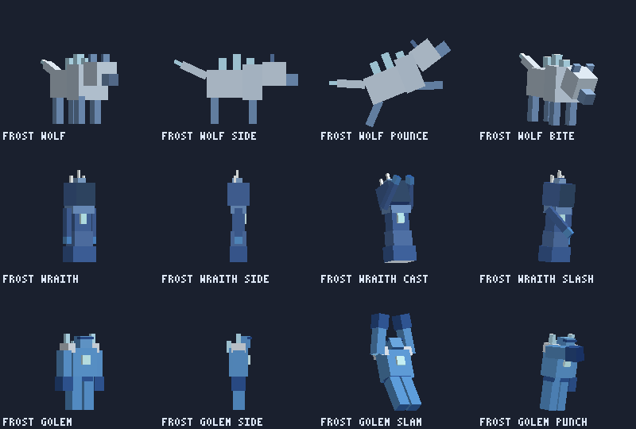
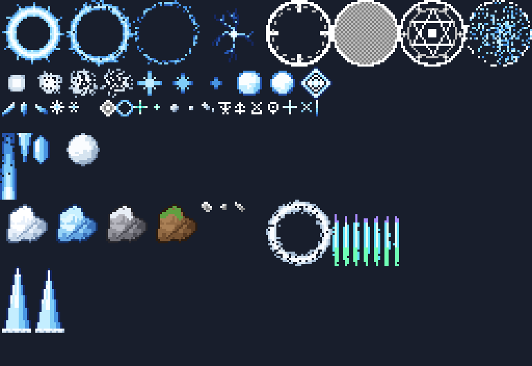
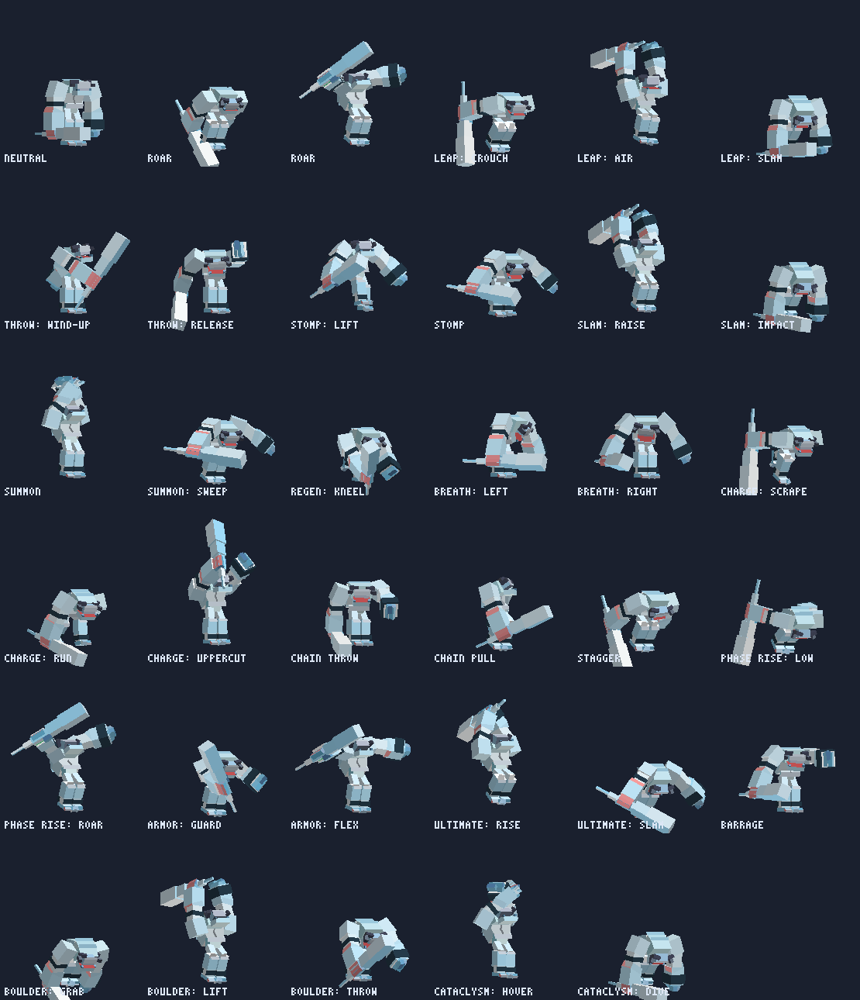

# Boss YETI v2 — Nâng cấp kỹ năng, particle, animation và đệ băng

Bản nâng cấp toàn diện cho addon **boss-YETI v1.2** (tác giả gốc: YTAUN): viết lại bộ kỹ năng của boss,
thêm bộ particle băng tự vẽ, animation riêng cho từng chiêu và 3 loại đệ băng mới.

- **Tải về:** [`dist/boss-YETI_v2_6.mcaddon`](dist/boss-YETI_v2_6.mcaddon), mở file là Minecraft tự nhập cả 2 pack.
- **Mỗi bản phát hành có UUID mới và số phiên bản tăng thêm 1** (2.1 → 2.2 → ...), nên Minecraft luôn coi đó là
  pack mới, không lẫn với bản cũ đã lưu. Khi nâng cấp: trong thế giới, gỡ pack boss-YETI cũ rồi bật bản **2.6.0**
  (có thể vào **Cài đặt → Bộ nhớ** xoá các bản cũ cho gọn).
- Yêu cầu giống bản v1.2: Script API `@minecraft/server` 2.7.0, không cần bật Experiments.

## Có gì mới

| | v1.2 | v2 |
|---|---|---|
| Chiêu của boss | Nhiều chiêu có thể nổ **cùng 1 tick**, không báo trước, gây sát thương ngay | Mỗi lần 1 chiêu, **có vòng/ô cảnh báo đỏ** trên đất, né được |
| Ai dính chiêu | Chỉ người chơi | **Mọi sinh vật** không thuộc phe Yeti: người chơi, dân làng, golem sắt, sói, pet, cả quái khác |
| Bị hất tung | Đánh thường + tiếng gầm hất người chơi lên trời | **Không hất tung**: vẫn giữ lõi iron golem và đòn vung tay gốc, nhưng mọi đòn chỉ đẩy lùi theo phương ngang |
| Gai băng | Là mob (entity) mọc lên | **Thuần particle**: gai băng pixel art đơn giản trên 2 tấm bắt chéo hình dấu "+", to, đâm lên từ lòng đất rồi vỡ vụn |
| Âm thanh | Âm vanilla (thuỷ tinh vỡ, nổ, gấu Bắc Cực...) | **21 âm thanh tự làm** (45 file): gầm, gai băng mọc/vỡ, đập băng, nổ lớn, gió bão, phép băng, tiếng bước chân... |
| Mục tiêu của chiêu | Người chơi gần nhất | **Con mà Yeti đang đánh** (hoặc đang đánh Yeti), không có thì con mồi gần nhất |
| Đệ | Zombie / skeleton / stray vanilla | **Sói Băng, Hồn Băng, Golem Băng** — model, texture, animation, kỹ năng riêng |
| Particle | Particle vanilla (snowflake, explosion...) | **39 particle băng** tự vẽ (pixel art) + particle vanilla |
| Animation | 2 animation chiêu (ice_spike, attack_2) | **20 animation chiêu** (bốc đất ném, bay lên lao xuống...) + hấp hối, 10 animation cho đệ; đánh thường dùng lại đòn vung tay gốc |
| Chuyển pha | Pha mới hiện ra lặng lẽ | Trồi dậy + gầm, bất tử 3 giây, tiêu đề **Pha 2 / Pha 3** |
| Dimension | Chỉ chạy ở Overworld | Chạy ở mọi dimension |

## Các pha

| Pha | Máu | Đặc điểm |
|---|---|---|
| `ytaun:yeti_1` **YETI** | 1000 | Gầm lên khi thấy mục tiêu. 9 chiêu, gọi bầy Sói Băng. |
| `ytaun:yeti_2` **YETI TRƯỞNG THÀNH** | 500 | Thêm bão tuyết, khe nứt, lốc xoáy, sóng băng, thiên thạch băng, Absolute Zero; gọi Hồn Băng. |
| `ytaun:yeti_3` **YETI CỔ ĐẠI** | 500 | Đủ bộ chiêu + xiềng băng, mưa pha lê, hơi thở băng, giáp băng, 3 thiên thạch; gọi Golem Băng. |
| `ytaun:yeti_death` **YETI HẤP HỐI** | 50 | Nửa người vùi trong băng, không di chuyển, tung chiêu liên tục. Hạ nó để thắng. |

- Dưới **35% máu**, Yeti **nổi giận**: gầm lên, ra chiêu nhanh hơn, hồi chiêu ngắn hơn, quanh người bốc lửa băng xanh.
- Nội tại giữ nguyên như v1.2: giáp (giảm 25/30/35% sát thương từ người chơi), sát khí lạnh (làm chậm kẻ địch đứng gần),
  tự hồi 2% máu/giây khi 6 giây không bị đánh, hồi 15% máu khi hạ gục người chơi (giờ tính cả khi chết vì chiêu).

## Bộ chiêu

Ô/vòng **đỏ** trên mặt đất = chỗ sắp trúng đòn. Vòng đỏ lan dần từ tâm ra, **chạm viền là đòn rơi xuống**.

| Chiêu | Pha | Animation | Cách né / phản công |
|---|---|---|---|
| **Cầu Băng** — ném cầu băng đón đầu; pha 2+: 3 quả toả quạt; pha 3: cầu vỡ thành 4 mảnh | 1 2 3 | Vặn người, vung tay ném | Đổi hướng chạy đột ngột |
| **Nhảy Đập** — nhảy vòng cung tới chỗ bạn, đập đất; pha 3: vòng gai băng quanh điểm rơi | 1 2 3 | Ngồi thụp, giơ nắm đấm trên không, nện xuống | Chạy ra khỏi vòng đỏ |
| **Ngục Băng** *(mới)* — lồng gai băng mọc quanh mục tiêu, giam 1.5 giây rồi nổ vào trong (9/12/15 sát thương) | 1 2 3 | Nhấc chân dậm đất | **Chạy ra khỏi vòng đỏ trước khi lồng đóng** |
| **Tuyết Lở** *(mới)* — 3/5/7 quả cầu tuyết khổng lồ lăn ra hình quạt, càng lăn càng to, đè bẹp và hất văng | 1 2 3 | Hai nắm đấm nện đất | Né khỏi các làn ô đỏ |
| **Bùng Nổ Băng** — gom băng 1 giây rồi nổ quanh thân, hất văng kẻ đứng sát | 1 2 3 | Nện hai tay | Lùi ra khỏi vòng đỏ |
| **Gai Băng** — các hàng gai băng (particle) mọc lần lượt về phía bạn | 1 2 3 | Hai nắm đấm nện đất | Ô đỏ đánh dấu chỗ từng gai sẽ mọc |
| **Ném Tảng Đất** *(mới)* — khom xuống thọc tay xuống đất **bốc một tảng đất khổng lồ** (tuyết / băng / đá / đất cỏ tuỳ nền dưới chân), nâng qua đầu rồi ném vòng cung; pha 3: tảng đất vỡ thành 5 mảnh nổ tiếp | 1 2 3 | Khom người bốc đất, nâng qua đầu, ném | Chạy ra khỏi vòng đỏ (hiện từ lúc tảng đất được nâng lên) |
| **Lao Đánh** — cào chân như bò tót rồi lao thẳng; trượt thì phóng 1 hàng gai | 1 2 3 | Cào chân, chạy, móc lên | Né khỏi hàng ô đỏ. **Lao vào tường → Yeti tự choáng** |
| **Hồi Phục Băng** — quỳ xuống trong vỏ pha lê, hồi máu 6 giây | 1 2 3 | Quỳ, ôm ngực, thở dốc | **Gây đủ 6–8% máu tối đa → vỏ vỡ, Yeti choáng** |
| **Triệu Hồi Đệ Băng / Đội Quân Tinh Nhuệ** — vòng rune băng dưới đất, cột sáng băng, 2–3 đệ băng chui lên (tối đa 3/4/5 con, 90 giây mới gọi lại) | 1 2 3 | Giơ tay lên trời rồi quét xuống | Diệt đệ; đệ tan biến khi thắng boss |
| **Bão Tuyết** — bão bám theo Yeti, băng nhọn rơi từ trời quanh người chơi | 2 3 | Giơ tay gọi bão | Mỗi cột băng có vòng đỏ báo trước |
| **Khe Nứt Sông Băng** — vết nứt chạy tới bạn, cột băng phun lên hất tung | 2 3 | Nện đất | Né khỏi hàng ô đỏ |
| **Lốc Xoáy Cực** *(mạnh hơn)* — xoay tròn 5 giây hút mọi thứ vào tâm, cuối chiêu **nổ ngược** bán kính 6 | 2 3 | Thân trên xoay tít, tay dang rộng | Chạy ngược ra ngoài; tránh vòng đỏ lúc nổ |
| **Sóng Sông Băng** — tường băng lan ra theo vòng tròn | 2 3 | Nện hai tay | **Nhảy qua sóng** (đang trên không thì không trúng) |
| **Thiên Thạch Băng** *(mới)* — thiên thạch băng rơi từ trời xuống mục tiêu (pha 3: 3 quả vào 3 kẻ địch), hố băng làm chậm | 2 3 | Giơ tay gọi | Chạy ra khỏi vòng đỏ lớn (2 giây) |
| **Absolute Zero** — tuyệt chiêu khi máu thấp: vòng băng khổng lồ + đếm ngược 3‑2‑1 | 2 3 | Bay lên vận khí, run bần bật, đập xuống | **Chạy ra khỏi vòng đỏ trước khi đếm hết** |
| **Lãnh Địa Băng Giá** *(mới)* — đấu trường băng 10 giây: tường cực quang không cho chạy ra, bão tuyết bên trong, 3 đợt **sóng băng quét cả lãnh địa** | 2 3 | Giơ tay gọi | **Chạy vào VÒNG RUNE XANH** (hiện 2 giây trước mỗi đợt) — chỉ ai đứng trong đó mới an toàn |
| **Băng Hà Giáng Thế** *(mới, tuyệt chiêu pha 3 dưới 50% máu)* — Yeti bay lên trời giữa vòng cực quang, bên dưới **3 vành đai băng nổ lần lượt** (ngoài → trong → giữa), băng nhọn rơi, cuối cùng lao thẳng xuống tâm nổ tung | 3 | Bật lên, lơ lửng dang tay run bần bật, giơ nắm đấm lao xuống | Nhìn vành đai phủ ô đỏ, **chạy sang vành còn lại** trước khi nổ; tránh vòng đỏ ở tâm lúc lao xuống |
| **Xiềng Băng** — quăng xiềng trói, 1.5 giây sau giật về phía Yeti | 3 | Vung tay quăng, rồi giật mạnh | **Chạy ra khỏi vòng đỏ dưới chân** để giật đứt xiềng |
| **Mưa Pha Lê** — 6 viên pha lê xoay trên đầu rồi lần lượt lao xuống | 3 | Giơ tay gọi, chỉ tay phóng | Mỗi viên có vòng đỏ ở chỗ rơi |
| **Hơi Thở Băng Giá** — phun hơi băng hình nón, quét trái sang phải | 3 | Hít sâu, cúi đầu phun, quét theo | Đứng sau lưng / ngoài hướng phun |
| **Giáp Băng** — 10 giây: giảm thêm 50% sát thương, phản 25% sát thương cận chiến | 3 | Bắt chéo tay rồi gồng lên | **Đánh trúng 12 đòn → giáp vỡ, Yeti choáng** |
| Dạng hấp hối: **Đập Băng**, **Bùng Nổ**, **Cơn Bão Cuối**, **Thiên Thạch** | hấp hối | Hai nắm đấm nện xuống băng | Vòng đỏ báo trước |

- Đã **bỏ các chiêu yếu** của bản trước: Đóng Băng Mặt Đất (chỉ làm chậm), Tiếng Gầm (chỉ làm chậm — giờ chỉ dùng khi
  thức tỉnh / nổi giận), Động Đất (trùng Sóng Sông Băng), gọi zombie/skeleton vanilla.
- Mọi đòn chỉ trúng mỗi mục tiêu **1 lần** và **không hất tung lên trời** (chỉ đẩy lùi ngang, làm chậm, đóng băng).
- Chiêu **không bao giờ** trúng phe Yeti: các pha Yeti, pet boss (`yeti_boss_pet`) và đệ băng.
- Hiệu ứng các chiêu cũ được làm hoành tráng hơn: vụ nổ lớn có sóng bụi tuyết lan xa, đá văng và vòng gai băng;
  Lao Đánh để lại hàng gai băng phía sau; Sóng Sông Băng thành bức tường gai băng lan ra; Nhảy Đập có cột sáng;
  Absolute Zero có vòng cực quang; băng nhọn rơi mọc gai khi chạm đất.

## Đệ băng mới



| Đệ | Máu | Đặc điểm | Kỹ năng riêng |
|---|---|---|---|
| **Sói Băng** `ytaun:frost_wolf` | 24 | Nhanh, đi theo bầy, cắn làm chậm | **Vồ**: nhảy xổ tới mục tiêu cách 4–10 block (5 sát thương) |
| **Hồn Băng** `ytaun:frost_wraith` | 18 | Bóng ma trùm mũ lơ lửng, áo choàng rách | **Tia Băng**: bắn cầu băng đuổi theo mục tiêu tới 16 block |
| **Golem Băng** `ytaun:frost_golem` | 70 | To, chậm, rất trâu, tay dài chạm đất | **Đập Đất**: sóng băng quanh người (vòng đỏ báo trước), hất văng |

- Pha 1 gọi 2 Sói Băng; pha 2: 1 Sói + 1 Hồn Băng; pha 3: 1 Golem + 1 Hồn Băng. "Đội Quân Tinh Nhuệ" (máu thấp)
  có thêm Golem, đệ tinh nhuệ được cộng Resistance + Strength. Tối đa 3/4/5 đệ cùng lúc, 90 giây mới gọi lại.
  Có trứng spawn trong Creative để thử riêng.
- Đệ đánh người chơi, dân làng, golem, sói, pet... nhưng không đánh Yeti và không bị chiêu của Yeti trúng.
  Chết thì vỡ tan thành băng; khi thắng boss, mọi đệ xung quanh tan biến.

## Particle



39 particle `yeti:*` vẽ theo phong cách pixel art của Minecraft (bảng màu băng: trắng → xanh nhạt → xanh lam → xanh đậm),
phần lớn là flipbook nhiều khung hình:

| Nhóm | Particle |
|---|---|
| Cảnh báo | `warning_circle` (viền đỏ nhấp nháy nhanh dần), `warning_fill` (mảng đỏ lan tới viền), `warning_tile`, `dome_edge` (tường băng của Absolute Zero) |
| Va chạm | `ice_burst` (ngôi sao băng), `frost_ring` (sóng băng 3 khung: dày → mỏng → vỡ), `ice_crack` (đất nứt), `ice_shard` (mảnh băng rơi, nảy trên đất), `snow_dust`, `frost_mist`, `hit_spark`, `ice_pillar`, `light_beam` |
| Chiêu | `ice_spike` (gai băng, 2 tấm bắt chéo "+") + `spike_shatter` (gai vỡ vụn), `boulder` (tảng đất 4 loại), `rock_debris`, `shockwave` (sóng bụi tuyết), `aurora` (cực quang), `frost_orb` + `orb_trail`, `snowball` (cầu tuyết lăn), `crystal`, `icicle`, `chain_link`, `breath`, `blizzard`, `vortex`, `charge_gather`, `rune_circle`, `glyph`, `heal`, `frost_field`, `frozen_mark` |
| Quanh boss (phía client) | `aura` (tuyết xoay quanh người), `aura_enraged` (lửa băng khi dưới 35% máu), `breath_puff` (hơi thở phả ra từ miệng — locator `mouth` mới trên hàm) |

## Animation



20 animation chiêu (`animation.yeti.*`) dùng chung cho mọi pha vì 4 model Yeti có cùng bộ xương chính.
Mỗi animation đủ nhịp **lấy đà → ra đòn → va chạm → dư chấn → hồi về**, lấy mẫu từ đường cong Catmull‑Rom mỗi 0.05 giây
nên chuyển động cong và mượt. Mốc va chạm trong animation khớp đúng tick sát thương trong script.

- **Khom người bốc đất - nâng qua đầu - ném**, **bật lên trời lơ lửng rồi lao xuống**. Đánh thường dùng đòn vung tay
  gốc của lõi iron golem (v2.3).
- **Gai băng** (particle, v2.6): gai băng **pixel art đơn giản kiểu vanilla** (16×32, ít màu: viền xanh đậm bậc thang,
  mặt trái sáng có vệt bóng, sống giữa trắng, mặt phải xanh đậm dần, đầu phủ sương, dải tuyết ở gốc), vẽ trên
  **2 tấm bắt chéo hình dấu "+"** (nhìn từ trên xuống) giống cây cỏ trong game, nên đi vòng quanh vẫn thấy khối. Gai đâm
  lên từ lòng đất đúng kích thước thật (không bị kéo giãn), đất nứt dưới chân, kèm 2 gai nhỏ; hết thời gian thì
  **vỡ vụn**. Chiêu mọc cả chục gai cùng lúc tự bớt gai phụ để đỡ lag. Độ to chung chỉnh bằng `SPIKE_SCALE` trong
  `scripts/yeti/fx.js`.
- **Yeti hấp hối** có animation thở dốc, lắc đầu, đấm xuống băng (bản cũ đứng im).
- Đệ băng có animation đi/đứng (theo tốc độ) và animation kỹ năng: sói vồ/cắn, hồn băng niệm phép/cào, golem đập đất/đấm.
- Ảnh trên được vẽ từ chính model bằng `tools/preview_anim.py` (không cần mở game).

## Âm thanh

21 âm thanh riêng của Yeti (`yeti.*`, 45 file `.ogg` trong `boss-YETI_resource_pack/sounds/yeti/`), **tự tổng hợp
từ đầu** bằng `tools/sounds.py` (không dùng file âm thanh của ai): tiếng nứt là tiếng ồn lọc cao, tiếng nổ là sóng sin
trầm trượt xuống, tiếng băng ngân là các hoạ âm lệch như chuông, tiếng gầm là giọng quái vật (sóng răng cưa rung +
tiếng khàn + bộ lọc nguyên âm), thêm tiếng vang. Phần lớn âm có 2-3 biến thể, game chọn ngẫu nhiên nên không lặp lại
y hệt.

| Âm | Dùng ở |
|---|---|
| `yeti.roar`, `yeti.roar.short` | Thức tỉnh, nổi giận, chuyển pha, gầm báo trước khi ra chiêu |
| `yeti.growl`, `yeti.hurt`, `yeti.death`, `yeti.step` | Tiếng của chính Yeti: gầm gừ khi đứng, bị đánh, chết, bước chân nặng |
| `yeti.spike.erupt`, `yeti.ice.shatter` | Gai băng đâm lên / vỡ vụn, băng vỡ (vỏ băng, giáp băng, mảnh băng) |
| `yeti.ice.impact`, `yeti.boom`, `yeti.stomp`, `yeti.hit` | Đập đất, thiên thạch, nổ cực lớn (Absolute Zero, Băng Hà Giáng Thế, lúc hạ gục Yeti), dậm chân, đòn đánh thường trúng |
| `yeti.frost.charge`, `yeti.frost.cast`, `yeti.frost.shoot`, `yeti.chime` | Tụ phép, phóng phép, bắn cầu băng / tia băng, chuông băng |
| `yeti.frost.thunder`, `yeti.wind.gust`, `yeti.frost.breath`, `yeti.whoosh`, `yeti.snow.crunch` | Sấm băng, gió bão, hơi thở băng, vung tay / ném, tuyết vỡ |

Đệ băng không còn im lặng: Sói Băng dùng tiếng sói trầm, Hồn Băng tiếng vex trầm, Golem Băng tiếng golem sắt + bước chân
Yeti. Vũ khí (Frozen Sword, Frozen Scythe, Ice Bar) cũng dùng âm băng mới.

## Vũ khí

| Vũ khí | Chuột phải | Đánh trúng |
|---|---|---|
| **Frozen Sword** | **Bước Băng**: Speed VIII 6 giây như cũ + lướt tới trước, để lại vệt tuyết | **Tê Cóng**: làm chậm như cũ; trúng cùng mục tiêu 3 lần trong 4 giây → băng vỡ tung (+5 sát thương) |
| **Frozen Scythe** | **Vệ Binh Băng**: Resistance II 3 giây + gọi tối đa 3 Yeti con đồng minh (60 giây, tối đa 5 con) + sóng băng làm chậm quái | Làm chậm + sóng băng nhỏ |
| **Ice Bar** | **Pháo Đài Băng**: Resistance II 5 giây + vòng gai băng 6 giây đẩy lùi quái | — |

Nội tại của Frozen Sword (cầm 20 giây / ngồi 4 giây) dùng hiệu ứng băng mới.

## Lỗi đã sửa

- Có thể tung 4–5 chiêu trong cùng 1 tick (không có khoá "đang thi triển" chung) → giờ mỗi lần 1 chiêu, nghỉ ngắn giữa 2 chiêu.
- Boss chỉ dùng chiêu ở Overworld → giờ ở mọi dimension.
- Sát thương chiêu không ghi nguồn → nội tại "hồi máu khi hạ gục" chỉ chạy với đòn đánh thường. Đã sửa.
- Các function summon `pa:yeti_pet`, `pa:yeti_boss_pet`, `pa:enderpet`, `pa:yeti_mage` (không có trong addon) → đổi sang `ytaun:*`
  hoặc bỏ dòng không có thực thể tương ứng. `yeti_1` không còn gọi summon mỗi lần đổi mục tiêu.
- Vũ khí dùng `@p` (người chơi gần nhất, có thể là người khác) → giờ áp dụng cho chính người dùng.
- `EntityDamageCause.suicide` (đã đổi tên trong Script API 2.x) → `selfDestruct` trong `durability_manager.js`.
- **Yeti đánh hất tung người chơi lên trời** (v2.2): do các pha Yeti dùng `runtime_identifier` của iron golem (cú đánh
  của golem sắt luôn hất mục tiêu lên) và tiếng gầm vanilla (`knockback_roar`) có lực dọc 5–6. Tiếng gầm giờ chỉ đẩy
  ngang, mọi chiêu chỉ đẩy ngang. **v2.3 trả lại lõi iron golem** (`runtime_identifier`, `offer_flower`) để giữ đòn
  vung tay gốc; cú hất lên trời của golem bị script ghi đè ngay trong tick trúng đòn và tick sau (đẩy lùi ngang nhẹ +
  ấn xuống đất), nên mục tiêu không bay lên.
- **Gai băng particle xấu** (v2.3): bản 2.2 là 1 hình phẳng xoay theo camera và bị kéo giãn khi mọc. Đã vẽ lại
  thành gai pixel art đơn giản trên 2 tấm bắt chéo hình "+" (v2.6, xem mục Animation).
- **Tràn pet boss** (v2.2): `yeti_2` gọi 4 pet mỗi lần đổi mục tiêu; `yeti_1`/`yeti_2` đẻ 10 pet khi xuất hiện;
  dạng hấp hối gọi 1 pet MỖI đòn bị đánh. Giờ: không gọi khi đổi mục tiêu, 2 pet khi xuất hiện, dạng hấp hối
  tối đa 1 pet / 12 giây (không quá 2 con).

## Tuỳ chỉnh

Mọi thông số nằm trong `PHASES` ở đầu [`boss-YETI_behavior_pack/scripts/yeti/boss.js`](boss-YETI_behavior_pack/scripts/yeti/boss.js):

- `damage`: hệ số sát thương mọi chiêu của pha đó (ví dụ `0.7` cho dễ hơn, `1.5` cho khó hơn).
- `armor`: % giảm sát thương nhận từ người chơi.
- `gcd`: khoảng nghỉ (tick) giữa 2 chiêu. `range`: tầm tìm mục tiêu.
- `kit`: danh sách chiêu — `cd` hồi chiêu (tick, 20 tick = 1 giây), `min`/`max` khoảng cách dùng chiêu,
  `hp` chỉ dùng khi máu dưới tỉ lệ này, `weight` độ ưu tiên. Xoá một dòng để tắt chiêu đó.

Số liệu riêng từng chiêu (bán kính, sát thương theo pha...) nằm trong [`scripts/yeti/skills.js`](boss-YETI_behavior_pack/scripts/yeti/skills.js),
nhóm đệ được gọi ở `PACKS` / `ELITE_PACKS` trong cùng file. Ai là "phe Yeti" / "con mồi" nằm trong
[`scripts/yeti/targets.js`](boss-YETI_behavior_pack/scripts/yeti/targets.js); máu, sát thương, tốc độ của đệ trong `MINIONS` ở `tools/minions.py`.

## Cấu trúc

```
yeti/
├── boss-YETI_behavior_pack/scripts/
│   ├── yeti/boss.js     bộ não: chọn chiêu, pha, nội tại, chuyển pha, sự kiện
│   ├── yeti/skills.js   các chiêu của boss + chiêu dạng hấp hối
│   ├── yeti/targets.js  ai là kẻ địch / con mồi / phe Yeti
│   ├── yeti/minions.js  kỹ năng của đệ băng (vồ, tia băng, đập đất)
│   ├── yeti/fx.js       particle, âm thanh, rung màn hình, vòng cảnh báo
│   ├── yeti/version.js  số phiên bản (build.py tự ghi)
│   └── item_trigger.js  kỹ năng vũ khí
├── boss-YETI_resource_pack/
│   ├── particles/yeti_*.json, textures/particle/yeti_particles.png   (sinh bởi tools/particles.py)
│   ├── sounds/yeti/*.ogg, sounds/sound_definitions.json, sounds.json (sinh bởi tools/sounds.py)
│   ├── animations/yeti_skills.animation.json                         (sinh bởi tools/animations.py)
│   ├── models/entity/yeti_minions.geo.json, textures/entity/minions/  (sinh bởi tools/minions.py,
│   │   cùng entity/animation của đệ ở cả 2 pack)
│   └── animation_controllers/yeti_fx.animation_controllers.json      (hào quang, hơi thở, nổi giận)
├── tools/               particles.py, animations.py, minions.py, sounds.py, preview_anim.py
└── build.py             sinh mọi thứ ở trên + ảnh xem trước, đóng gói dist/boss-YETI_v<phiên bản>.mcaddon
```

Sửa particle/animation/đệ thì sửa file trong `tools/` rồi chạy (Python 3, không cần thư viện ngoài):

- `python3 build.py` — **bản phát hành**: tạo UUID mới cho cả 2 pack, tăng phiên bản thêm 1, đóng gói file mới.
- `python3 build.py --no-bump` — đóng gói lại đúng phiên bản hiện tại (giữ UUID), dùng khi thử nghiệm.
- Thêm `--sounds` để tổng hợp lại toàn bộ âm thanh sau khi sửa `tools/sounds.py` (cần `oggenc` của gói vorbis-tools
  để nén sang .ogg). Không có cờ này thì build giữ nguyên các file .ogg đã có, chỉ tạo file còn thiếu.
