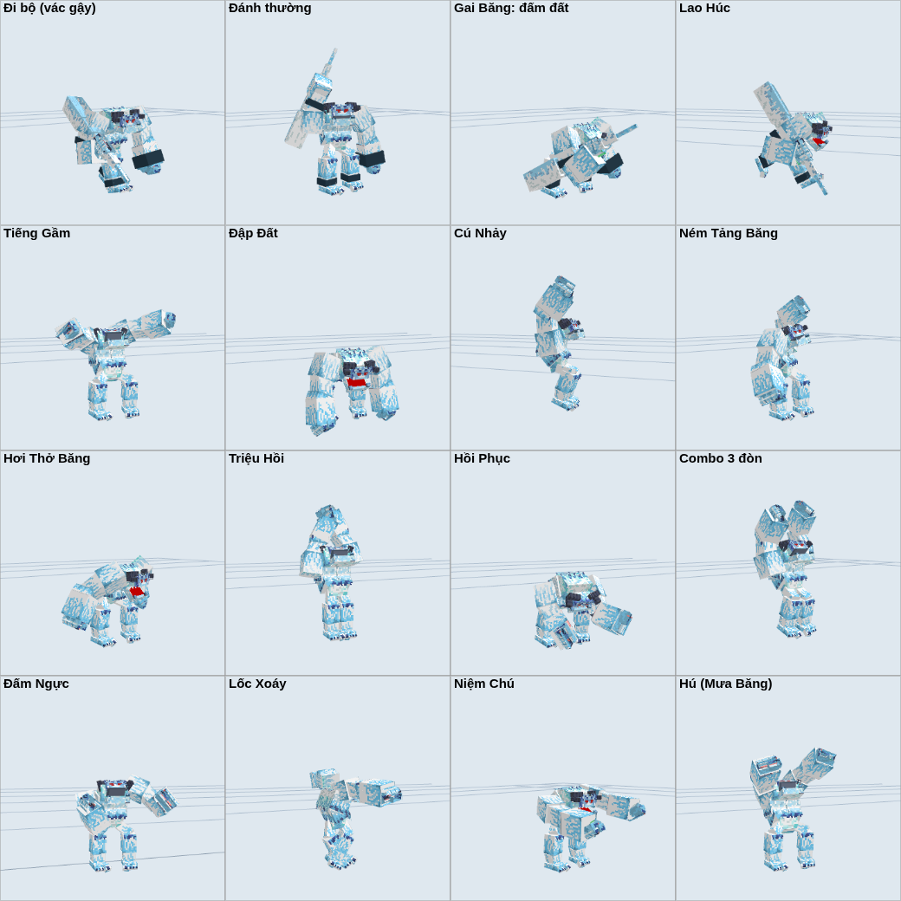

# Boss Yeti v1.4: sửa khớp model, làm lại toàn bộ skill

Addon Minecraft Bedrock **boss-YETI** (tác giả YTAUN). Boss vẫn có 3 pha tiến hóa
(`ytaun:yeti_1` → `ytaun:yeti_2` → `ytaun:yeti_3` → `ytaun:yeti_death`) với cơ chế như trước.
Bản 1.4 sửa lại khớp của model, làm lại animation và toàn bộ phần hình ảnh của skill.

## Cài đặt

1. Tải [`dist/boss-YETI_v1_4_0.mcaddon`](dist/boss-YETI_v1_4_0.mcaddon) rồi mở file, Minecraft sẽ tự nhập cả 2 pack.
2. Trong thế giới: **Behavior Packs**, bật *boss-YETI* (Resource Pack được bật kèm theo).

> **Nâng cấp từ bản cũ:** UUID của pack giữ nguyên, chỉ tăng version lên 1.4.0, nên bản mới thay thế bản cũ.
> Nếu vào game vẫn thấy model hoặc skill cũ, hãy vào **Cài đặt → Bộ nhớ**, xóa pack boss-YETI cũ rồi nhập lại file `.mcaddon`.
> Mob gai băng `ytaun:ice_spike_yeti_boss` đã bị xóa. Nếu thế giới cũ còn sót gai băng đang đứng thì dùng `/kill @e[type=ytaun:ice_spike_yeti_boss]` trước khi nâng cấp.

## Có gì mới trong v1.4

### Sửa khớp model

Model gốc có một số khớp đặt sai chỗ, nên khi animation bẻ khớp thì tay bị gãy hoặc rời ra:

| Lỗi | Hậu quả | Đã sửa |
|---|---|---|
| Pha 1–2: bone khuỷu tay (`bone17`/`bone26`) nằm ở vai và giữ cả bắp tay | Gập khuỷu thì cả cánh tay gập theo | Thêm `elbow_r`/`elbow_l` đúng chỗ bắp tay nối cẳng tay |
| Pha 3 và dạng xác: trục khuỷu tay lệch sang bên | Cẳng tay xoay lệch | Như trên |
| Cả 4 model: bone bàn tay (`bone16`/`bone21`) xoay quanh đầu móng | Xoay cổ tay thì bàn tay rời khỏi cẳng tay | Thêm `wrist_r`/`wrist_l` ở cổ tay. Móng vuốt và gậy băng bám theo cổ tay |
| Trục sọ (`bone45`) nằm sau gáy 9 pixel | Ngửa đầu thì sọ trượt ra sau | Đưa trục về sau đầu |
| Pha 1–2: gậy băng nằm dưới đất ở tư thế nghỉ | Phải dùng animation đè lên để nhấc gậy | Tư thế nghỉ mới: vác gậy trên vai |

Hình dạng model khi đứng yên không đổi (chỉ di chuyển trục xoay). Mình cũng thêm locator ở miệng, mắt, 2 tay, 2 chân và ngực để gắn hiệu ứng.
Tất cả được làm bằng `tools/rig.py`.

### Animation làm lại

19 animation mới dùng chung cho cả 3 pha, thay các animation cũ (đi, đứng, đánh, gai băng, lao).
Mỗi animation bẻ đủ các khớp: vai, khuỷu, cổ tay, hông, gối (dáng đứng tấn khi đập đất), hàm, sọ, ngực phập phồng khi thở.
Khi gầm hoặc gồng lực có thêm rung đầu và rung tay.

- **Luôn chạy:** đứng thở (ngực phập phồng, phả hơi lạnh, mắt phát sáng; pha 3 mắt đỏ), đi bộ nặng nề (bước dài, nhún người, tốc độ theo tốc độ chạy), đánh thường (vung tay hoặc gậy qua đầu rồi nện xuống).
- **Skill:** gầm, đập đất, nhảy, ném, phun băng, triệu hồi, hồi phục (ngồi thụp ôm ngực), vuốt kép, combo 3 đòn, đấm ngực, xoay, niệm chú, hú lên trời, đấm đất gọi gai, lao húc, xuất hiện pha mới.
- **Hiệu ứng gắn theo animation:** hơi băng ở miệng khi gầm, năng lượng tụ ở tay khi gồng, vệt băng theo móng khi vuốt, bụi tuyết ở tay hoặc chân khi đập đất hoặc tiếp đất, tảng băng hiện trong tay khi ném.



### Skill làm lại

Danh sách skill và cơ chế **giữ như v1.3** (sát thương, hồi chiêu, ngưỡng máu). Phần làm lại:

- **Gai Băng giờ là particle.** Mob gai băng đã bị xóa. Boss đấm xuống đất, các hàng gai mọc về phía mục tiêu. Gai cũng xuất hiện trong nhiều chiêu khác: vòng gai quanh chỗ tiếp đất, gai trồi theo Sóng Băng Hà và Động Đất, đường gai Rãnh Băng.
- **Skill đánh trúng cả mob mà boss đang nhắm**, không chỉ người chơi. Gồm chó, mèo, cáo, sói, dân làng, hoglin, zoglin, golem, cộng với bất kỳ mob nào vừa đánh boss. Boss cũng quay sang dùng skill vào mob đang đánh nó.
  Skill không đánh quái do boss triệu hồi, thú cưng của boss hay mob hiền đứng gần.
- **Va chạm nhiều lớp:** chớp sáng, sóng xung kích, khối vụn băng nảy trên đất, mảnh băng, bụi tuyết, sương băng lan ra và vết nứt băng.
- **Vòng cảnh báo có lớp phủ lớn dần,** chạm vòng ngoài đúng lúc đòn đánh xuống. Nhìn là biết còn bao lâu để né.
- **Pha 2 và 3: Vuốt Băng thành combo 3 đòn:** vuốt phải, vuốt trái, rồi nhảy lên đập đất.
- Thêm vòng rune xoay dưới đất cho Băng Địa, Triệu Hồi, Lốc Xoáy, Độ Không Tuyệt Đối, Ngục Băng và Xiềng Băng.
- Thêm cột lốc tuyết cho Lốc Xoáy và Triệu Hồi, tuyết rơi cho Băng Địa và Độ Không Tuyệt Đối.
- Thêm lửa băng quanh boss khi Cuồng Nộ và Giáp Băng, khối băng bao người bị đóng băng, xích băng lấp lánh cho Xiềng Băng, thiên thạch băng cho Mưa Tảng Băng ở pha 3.
- Boss để lại vết băng dưới mỗi bước chân. Đòn đánh thường có chớp sáng và mảnh băng ở chỗ trúng.

| Chiêu | Pha | Animation |
|---|---|---|
| Vuốt Băng / Combo 3 đòn | 1 / 2, 3 | `swipe` / `combo` |
| Gai Băng | 1, 2, 3 | `ground_punch` |
| Lao Húc | 1, 2, 3 | `charge` |
| Ném Tảng Băng | 1, 2 | `throw` |
| Mưa Tảng Băng | 3 | `throw` (liên tiếp) |
| Tiếng Gầm Băng Giá, Bùng Nổ Băng | 1, 2, 3 / 3 | `roar` |
| Băng Địa, Sóng Băng Hà | 1 / 2, 3 | `slam` |
| Cú Nhảy Nghiền Băng, Động Đất Băng | 1, 2, 3 / 2, 3 | `leap` |
| Hơi Thở Băng Giá | 2, 3 | `breath` |
| Mưa Băng Nhọn | 2, 3 | `howl` |
| Rãnh Băng | 2, 3 | `ground_punch` |
| Lốc Xoáy Cực Địa | 2, 3 | `spin` |
| Hồi Phục Băng Giá | 1, 2, 3 | `regen` |
| Triệu Hồi, Elite Army | 1, 2, 3 | `summon` |
| Độ Không Tuyệt Đối, Xiềng Băng, Ngục Băng | 2, 3 / 3 / 3 | `cast` |
| Giáp Băng, Cuồng Nộ | 3 | `chest_beat` |
| Xuất hiện pha mới | 1, 2, 3 | `phase_intro` |

### Particle

Có 40 particle, dùng chung 1 atlas pixel art 512×512 (`textures/particle/ytaun_yeti_fx.png`). Particle có viền xanh đậm để vẫn nhìn rõ trên nền tuyết.


## Cấu trúc

| File | Nội dung |
|---|---|
| `scripts/custom/yeti_fx.js` | Tiện ích: tên animation và particle, hiệu ứng va chạm, gai băng, vòng cảnh báo, chọn mục tiêu, khóa thi triển |
| `scripts/custom/yeti_skills.js` | Toàn bộ skill (kể cả Gai Băng và Lao Húc) |
| `scripts/custom/yeti_brain.js` | Chọn chiêu và chọn mục tiêu, vết chân |
| `scripts/custom/yeti_phase1/2/3.js` | Cấu hình từng pha: chiêu nào, sát thương, hồi chiêu, điều kiện dùng |
| `scripts/custom/yeti_boss_skill.js` | Nội tại, giáp, dạng `yeti_death`, màn xuất hiện của mỗi pha |
| `animations/ytaun_yeti_skills.animation.json` | 21 animation của Yeti, sinh bằng `tools/animations.py` |
| `animation_controllers/ytaun_yeti.animation_controllers.json` | Controller đánh thường |
| `tools/rig.py` | Sửa khớp model (đã chạy, chạy lại không đổi gì) |

Muốn chỉnh độ khó, sửa số trong `yeti_phase1.js`, `yeti_phase2.js` và `yeti_phase3.js`.
`cd` là hồi chiêu tính bằng tick (20 tick = 1 giây), `when` là điều kiện dùng chiêu (`c.d` là khoảng cách tới mục tiêu, `c.hp` là % máu).

## Tự build lại

```bash
pip install pillow
python3 yeti/tools/build.py
```

Lệnh này tạo lại texture và JSON của particle, file animation và ảnh preview particle. Sau đó nó kiểm tra:

- Mọi particle và animation mà script dùng đều tồn tại.
- Mọi bone mà animation bẻ đều có trong model.
- Mọi locator và particle mà animation gắn đều có trong model và client entity.

Cuối cùng nó đóng gói `dist/boss-YETI_v<version>.mcaddon`.

## Lưu ý (có sẵn từ bản gốc, chưa sửa)

- `functions/Pet_Yeti_boss.mcfunction` và `Pet_Yeti_death.mcfunction` gọi `summon pa:yeti_boss_pet` / `pa:yeti_mage`.
  Hai entity này không có trong addon, nên các lệnh đó không làm gì. Pet của boss trong addon này có tên `ytaun:yeti_boss_pet`.
